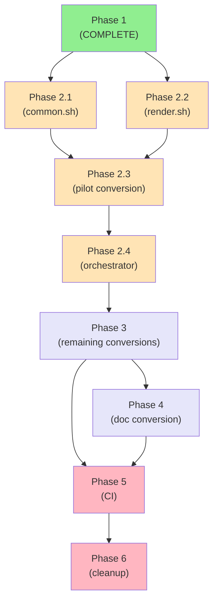

# Implementation Plan: Jinja Template Documentation System

## Current State

**Existing analysis scripts (8):**
- `analyze-binwalk.sh` - Firmware structure analysis
- `analyze-boot-process.sh` - Boot process analysis
- `analyze-device-trees.sh` - Device tree analysis
- `analyze-network-services.sh` - Network service discovery
- `analyze-proprietary-blobs.sh` - Proprietary binary identification
- `analyze-rootfs.sh` - Root filesystem analysis
- `analyze-secure-boot.sh` - Secure boot analysis
- `analyze-uboot.sh` - U-Boot analysis

**Current output:** Scripts generate markdown directly to `output/*.md`

**Existing documentation:** 16 analysis docs in `docs/analysis/`

## Migration Strategy

Convert from:
```
analyze-binwalk.sh → output/binwalk-scan.md
```

To:
```
analyze-binwalk.sh → results/binwalk.toml (JSON → TOML with source metadata)
templates/wiki/Binwalk-Analysis.md.j2 + results/binwalk.toml → wiki/Binwalk-Analysis.md
```

## Implementation Phases

### Phase 1: Infrastructure (COMPLETE ✅)
- [x] Jinja template system with TrackedValue
- [x] Hash-based caching with manifest
- [x] Automatic footnote generation
- [x] Test framework (13 tests passing)
- [x] CI integration (pytest + shellcheck)
- [x] Issue templates
- [x] Documentation updates (CLAUDE.md, AGENTS.md)

### Phase 2: Core Conversion (3-4 issues)

**Issue 2.1: Update common.sh library for JSON output**
- Modify `lib/common.sh` to support JSON output mode
- Add helpers: `json_field()`, `json_source()`, `json_method()`
- Keep backward compatibility with markdown output
- Test with analyze_test.sh pattern

**Issue 2.2: Create render_wiki.sh batch renderer**
- Script to render all templates in `templates/wiki/`
- Parallel rendering using ThreadPoolExecutor (optional)
- Progress indicator
- Error handling and validation
- Integration with CI

**Issue 2.3: Convert analyze-binwalk.sh (PILOT)**
- Convert to output JSON with source metadata
- Create template: `templates/wiki/Binwalk-Analysis.md.j2`
- Verify: results/binwalk.toml created
- Verify: Rendered markdown has footnotes
- Verify: All tests pass
- Document learnings for remaining conversions

**Issue 2.4: Update analyze.sh orchestrator**
- Call all analysis scripts
- Trigger template rendering
- Handle caching and incremental updates
- Update output directory structure

### Phase 3: Remaining Conversions (8 issues)

Convert each analysis script following the pilot pattern:

**Issue 3.1: Convert analyze-boot-process.sh**
**Issue 3.2: Convert analyze-device-trees.sh**
**Issue 3.3: Convert analyze-network-services.sh**
**Issue 3.4: Convert analyze-proprietary-blobs.sh**
**Issue 3.5: Convert analyze-rootfs.sh**
**Issue 3.6: Convert analyze-secure-boot.sh**
**Issue 3.7: Convert analyze-uboot.sh**
**Issue 3.8: Migrate dump/extract scripts**

Each includes:
- Script conversion to JSON output
- Template creation
- Results verification
- Tests (if needed)
- Documentation update

### Phase 4: Documentation Conversion (2 issues)

**Issue 4.1: Convert docs/analysis/ to templates**
- Migrate 16 existing markdown docs to Jinja templates
- Ensure all values use `| src` filter
- Verify footnotes link correctly
- Update wiki sync workflow

**Issue 4.2: Update wiki pages**
- Convert wiki/Home.md to template (if needed)
- Convert wiki/Usage-Guide.md to template (if needed)
- Update wiki/_Sidebar.md with new pages
- Test wiki sync workflow

### Phase 5: CI/CD Integration (1 issue)

**Issue 5.1: Automated template rendering in CI**
- Add template rendering to `.github/workflows/ci.yml`
- Verify rendered docs match templates + results
- Auto-commit rendered wiki pages (optional)
- Fail CI if templates can't render

### Phase 6: Cleanup (1 issue)

**Issue 6.1: Remove legacy markdown generation**
- Remove markdown output code from common.sh
- Remove old output/*.md files
- Update documentation
- Final verification all tests pass

## Dependencies



## Parallelization Opportunities

Can work in parallel after Phase 2.3 pilot completes:
- Issues 3.1-3.8 (script conversions) can be done independently
- Issues 4.1-4.2 (doc conversions) can be done independently
- Only Phase 5 and 6 must be sequential

## Success Criteria

- [ ] All 8 analysis scripts output JSON with source metadata
- [ ] All analysis results cached in `results/*.toml`
- [ ] All documentation rendered from templates
- [ ] All values in docs have footnotes linking to source scripts
- [ ] No "magic numbers" in documentation
- [ ] CI validates templates render correctly
- [ ] All 13+ tests passing
- [ ] shellcheck passing on all bash scripts
- [ ] Documentation updated (CLAUDE.md, AGENTS.md, README)

## Estimated Issues

- Phase 2: 4 issues
- Phase 3: 8 issues
- Phase 4: 2 issues
- Phase 5: 1 issue
- Phase 6: 1 issue
- **Total: 16 issues**

## Next Steps

1. Review this implementation plan
2. Create GitHub issues for Phase 2 using issue templates
3. Begin with Issue 2.1 (common.sh update)
4. Proceed sequentially through Phase 2
5. Parallelize Phase 3 and 4 after pilot success
