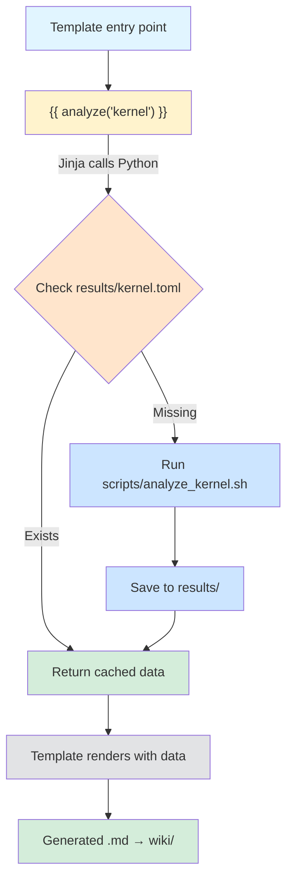

# Design: Jinja Template-Based Documentation System

## Problem Statement

Current documentation workflow violates our black box reverse engineering methodology:

- No enforcement that documented values come from scripts
- Manual copy-paste of offsets/addresses prone to errors
- Difficult to verify docs match current analysis results
- Unclear what changed when re-analyzing firmware
- "Magic numbers" can slip into documentation without traceability

## Proposed Architecture

### Flow



### Key Principles

1. **Templates are declarative** - they declare what data they need, not how to get it
2. **Separation of concerns** - no analysis logic in templates
3. **Lazy evaluation** - only run analysis when rendering docs that need it
4. **Cached results are browsable** - stored as human-readable TOML in `results/`
5. **Namespace traceability** - `kernel.offset` comes from `analyze('kernel')` script

## Design Decisions

### 1. Jinja Template Calls (Option B)

Templates call Python functions explicitly:

```jinja

Kernel offset: {{ kernel.offset_hex }}
```

**Rationale:**
- Easy to grep for `analyze('kernel')` calls
- Clear dependency graph
- Maintains separation of concerns (no analysis logic in templates)

### 2. Results Storage (File-based TOML)

```
results/
  kernel.toml
  filesystem.toml
  partitions.toml
```

**Format: TOML**
- More readable than JSON for browsing results
- Supports comments for annotations
- Scripts output JSON (universal), Python converts to TOML for storage

**Example (`results/kernel.toml`):**
```toml
# Kernel analysis results
# Generated by: scripts/analyze_kernel.sh
# Firmware: glkvm-RM1-1.7.2-1128-1764344791.img

offset = 8192
offset_hex = "0x2000"
size = 4194304
size_hex = "0x400000"
compression = "gzip"
magic_bytes = "1f 8b 08 00"
discovered_via = "binwalk -e firmware.img | grep 'gzip compressed'"
```

**Rationale:**
- Results are browsable (not hidden in `.cache/`)
- TOML is human-friendly for inspection
- These are our findings - should be visible and committable

### 3. Cache Invalidation

**Automatic hash-based invalidation using manifest:**

Keep clean filenames (`results/kernel.toml`) and track hashes in a manifest:

```toml
# results/.manifest.toml
[kernel]
firmware_hash = "abc123ef..."
script_hash = "def456ab..."
last_updated = "2025-12-11T10:30:00Z"

[filesystem]
firmware_hash = "abc123ef..."
script_hash = "789012cd..."
last_updated = "2025-12-11T10:31:00Z"
```

**Algorithm:**
1. Calculate hash of firmware + analysis script
2. Compare against manifest
3. If hashes match → use cached results
4. If hashes differ → re-run analysis, update manifest

**Rationale:**
- Clean filenames in `results/`
- Manifest committable to show analysis state
- Easy to see what changed: `git diff results/.manifest.toml`
- Hashes prove results derive from specific firmware + script versions

### 4. What Gets Committed

```
✅ Commit:
- templates/wiki/*.md.j2          (template source)
- scripts/analyze_*.sh or *.py    (analysis scripts)
- scripts/analysis.py             (Python analysis framework)
- scripts/render_wiki.sh          (render script)
- results/*.toml                  (analysis findings - these ARE our data!)
- results/.manifest.toml          (hashes proving results derivation)
- wiki/*.md                       (rendered docs for GitHub)

❌ Don't commit:
- downloads/*.img                 (firmware binaries)
- output/*.img                    (extracted binaries)
- __pycache__/                    (Python bytecode)
```

**Rationale:**
- `results/` contains our structured findings from black box analysis
- `wiki/` committed so GitHub displays documentation
- Binary artifacts are gitignored but scripts can regenerate them

### 5. Directory Structure

```
glinet-comet-reversing/
├── templates/
│   └── wiki/
│       ├── Kernel-Extraction.md.j2
│       ├── Filesystem-Layout.md.j2
│       └── Partition-Table.md.j2
├── scripts/
│   ├── analysis.py               # Python framework (caching, memoization)
│   ├── analyze_kernel.sh         # Kernel analysis script
│   ├── analyze_filesystem.sh     # Filesystem analysis script
│   └── render_wiki.sh            # Template renderer
├── results/
│   ├── kernel.toml               # Kernel analysis findings
│   └── filesystem.toml           # Filesystem analysis findings
├── wiki/
│   ├── Kernel-Extraction.md      # Rendered from template
│   └── Filesystem-Layout.md      # Rendered from template
├── docs/
│   └── README.md                 # How to run, setup instructions
└── output/                       # Extracted binaries (gitignored)
```

**Content guidelines:**
- **Wiki**: Results and methodology documentation
- **docs/README.md**: How to run the analysis, setup instructions, usage guide

### 6. Python Analysis API

**Core interface:**

```python
# scripts/analysis.py
from functools import lru_cache
from pathlib import Path
import subprocess
import json
import hashlib
import tomlkit
from datetime import datetime

@lru_cache(maxsize=None)
def analyze(analysis_type: str) -> dict:
    """
    Main function called from Jinja templates.
    Uses memoization to avoid re-running during single render pass.
    """
    results_file = Path(f'results/{analysis_type}.toml')
    manifest_file = Path('results/.manifest.toml')

    # Check if cache is valid
    if is_cache_valid(analysis_type, manifest_file):
        return tomlkit.load(results_file.open())

    # Run analysis
    result = run_analysis(analysis_type)

    # Save results
    results_file.parent.mkdir(exist_ok=True)
    with atomic_write(results_file) as f:
        doc = tomlkit.document()
        doc.add(tomlkit.comment(f"Generated by analyze_{analysis_type}"))
        doc.add(tomlkit.comment(f"Timestamp: {datetime.now().isoformat()}"))
        for key, value in result.items():
            doc[key] = value
        tomlkit.dump(doc, f)

    # Update manifest
    update_manifest(analysis_type, manifest_file)

    return result

def is_cache_valid(analysis_type: str, manifest_file: Path) -> bool:
    """Check if cached results are still valid."""
    results_file = Path(f'results/{analysis_type}.toml')

    if not results_file.exists() or not manifest_file.exists():
        return False

    manifest = tomlkit.load(manifest_file.open())
    if analysis_type not in manifest:
        return False

    # Calculate current hashes
    current_fw_hash = hash_file('downloads/firmware.img')
    current_script_hash = hash_analysis_script(analysis_type)

    # Compare with manifest
    cached = manifest[analysis_type]
    return (cached['firmware_hash'] == current_fw_hash and
            cached['script_hash'] == current_script_hash)

def update_manifest(analysis_type: str, manifest_file: Path):
    """Update manifest with current hashes."""
    if manifest_file.exists():
        manifest = tomlkit.load(manifest_file.open())
    else:
        manifest = tomlkit.document()

    manifest[analysis_type] = {
        'firmware_hash': hash_file('downloads/firmware.img'),
        'script_hash': hash_analysis_script(analysis_type),
        'last_updated': datetime.now().isoformat()
    }

    with atomic_write(manifest_file) as f:
        tomlkit.dump(manifest, f)

def hash_file(filepath: str) -> str:
    """Calculate SHA256 hash of file."""
    sha256 = hashlib.sha256()
    with open(filepath, 'rb') as f:
        for chunk in iter(lambda: f.read(8192), b''):
            sha256.update(chunk)
    return sha256.hexdigest()[:16]  # First 16 chars

def hash_analysis_script(analysis_type: str) -> str:
    """Calculate hash of analysis script."""
    for ext in ['.sh', '.py']:
        script = Path(f'scripts/analyze_{analysis_type}{ext}')
        if script.exists():
            return hash_file(str(script))
    return "unknown"

def run_analysis(analysis_type: str) -> dict:
    """Execute analysis script and parse JSON output."""
    # Try bash script first (during transition period)
    bash_script = Path(f'scripts/analyze_{analysis_type}.sh')
    if bash_script.exists():
        output = subprocess.check_output([bash_script], text=True)
        return json.loads(output)  # Bash script outputs JSON

    # Try Python version
    py_script = Path(f'scripts/analyze_{analysis_type}.py')
    if py_script.exists():
        # Import and call Python function
        import importlib.util
        spec = importlib.util.spec_from_file_location(analysis_type, py_script)
        module = importlib.util.module_from_spec(spec)
        spec.loader.exec_module(module)
        return module.analyze()  # Python script has analyze() function

    raise FileNotFoundError(f"No analysis script found for '{analysis_type}'")

def atomic_write(filepath: Path):
    """Context manager for atomic file writes (prevents race conditions)."""
    # Implementation: write to temp file, then rename
    # (rename is atomic on POSIX systems)
    pass
```

**Decorator pattern for memoization:**
- `@lru_cache` on `analyze()` prevents re-running during single render pass
- File-based cache in `results/` persists across runs
- Two-tier caching: memory (fast) + disk (persistent)

### 7. Template Example

```jinja
{# templates/wiki/Kernel-Extraction.md.j2 #}


# Kernel Extraction

## Location

The kernel partition was found at offset `{{ kernel.offset_hex }}` ({{ kernel.offset }} bytes).

**Discovery method:**
```bash
{{ kernel.discovered_via }}
```

## Details

| Property | Value | Method |
|----------|-------|--------|
| Size | {{ kernel.size_hex }} ({{ kernel.size }} bytes) | binwalk analysis |
| Compression | {{ kernel.compression }} | Magic bytes: `{{ kernel.magic_bytes }}` |

## Extraction

To extract the kernel from firmware:

```bash
# This artifact can be generated by running:
# ./scripts/extract_kernel.sh

dd if=downloads/firmware.img of=output/kernel.img \
   bs=1 skip={{ kernel.offset }} count={{ kernel.size }}
```

**Note:** Binary artifact `output/kernel.img` is not committed to repository.
Run the extraction script above to generate it locally.
```

**Namespace traceability:**
- `analyze('kernel')` → runs `scripts/analyze_kernel.sh`
- All `kernel.*` values come from that single source
- Easy to trace: "Where does `kernel.offset` come from?" → grep for `analyze('kernel')` in template

### 8. Race Conditions

**Problem:** Multiple template renders could try to write same results file simultaneously.

**Solution:** Atomic writes using temp file + rename pattern:

```python
import tempfile
import os

def atomic_write(filepath: Path):
    """Write to temp file, then atomically rename."""
    tmp_fd, tmp_path = tempfile.mkstemp(
        dir=filepath.parent,
        prefix=f'.{filepath.name}.',
        suffix='.tmp'
    )
    try:
        with os.fdopen(tmp_fd, 'w') as f:
            yield f
        os.rename(tmp_path, filepath)  # Atomic on POSIX
    except:
        os.unlink(tmp_path)
        raise
```

### 9. Binary Artifacts

**Problem:** Analysis may extract binary files (kernel.img, filesystem.squashfs) but these shouldn't be committed.

**Solution:**

1. Scripts extract to `output/` (gitignored)
2. Results file references the artifact location:
   ```toml
   [kernel]
   offset = 8192
   extracted_to = "output/kernel_abc123.img"  # Reference only
   ```
3. Templates render instructions to generate artifact:
   ```markdown
   Binary artifact not committed. Generate via:
   `./scripts/extract_kernel.sh`
   ```

### 10. Testing (pytest integration)

**Scope:** Testing analysis scripts and Python framework, orthogonal to template rendering.

```
tests/
├── test_analysis.py          # Test analysis.py framework
├── test_analyze_kernel.py    # Test kernel analysis logic
└── fixtures/
    └── sample_firmware.img   # Small test firmware
```

**Example test:**
```python
# tests/test_analyze_kernel.py
import pytest
from scripts.analysis import analyze

def test_kernel_analysis_structure():
    """Verify kernel analysis returns required fields."""
    result = analyze('kernel')
    assert 'offset' in result
    assert 'offset_hex' in result
    assert 'size' in result
    assert 'discovered_via' in result

def test_kernel_offset_consistency():
    """Verify offset_hex matches offset value."""
    result = analyze('kernel')
    assert result['offset_hex'] == hex(result['offset'])
```

**Integration with nix:**
```nix
# flake.nix
devShells.default = pkgs.mkShell {
  packages = with pkgs; [
    python311
    python311Packages.pytest
    python311Packages.jinja2
    python311Packages.tomlkit
  ];
};
```

**Note:** Python 3.11+ has built-in `tomllib` for reading TOML, but we use `tomlkit` because:
- Handles both reading and writing
- Preserves comments and formatting
- Can programmatically add comments to results files

## Implementation Plan

### Phase 1: Proof of Concept
- [ ] Add Python/Jinja2/toml to nix flake
- [ ] Implement `scripts/analysis.py` framework
- [ ] Convert `scripts/extract_kernel.sh` to output JSON
- [ ] Create `templates/wiki/Kernel-Extraction.md.j2`
- [ ] Implement `scripts/render_wiki.sh`
- [ ] Test: render one wiki page

### Phase 2: Testing Infrastructure
- [ ] Add pytest to nix flake
- [ ] Create `tests/test_analysis.py`
- [ ] Create `tests/test_analyze_kernel.py`
- [ ] Document testing approach in docs/

### Phase 3: Migration
- [ ] Convert remaining analysis scripts to output JSON
- [ ] Create templates for all wiki pages
- [ ] Update CLAUDE.md with new workflow
- [ ] Update AGENTS.md with template conventions

### Phase 4: CI Integration
- [ ] Add template rendering to GitHub Actions
- [ ] Add pytest to CI
- [ ] Verify rendered docs match templates + results
- [ ] Auto-commit wiki pages on push to main

## Success Criteria

- [ ] No documentation contains values not traceable to script output
- [ ] Templates clearly show which script provides each value (namespace)
- [ ] Anyone can re-run scripts and reproduce docs
- [ ] Results are browsable in `results/*.toml`
- [ ] CI verifies docs are up-to-date
- [ ] Tests verify analysis scripts work correctly

## Design Decisions (Resolved)

1. ✅ **Cache invalidation:** Hash-based with manifest file (`results/.manifest.toml`)
2. ✅ **Script language:** Wrap bash during transition, opportunistically refactor to Python
3. ✅ **TOML library:** `tomlkit` (handles read/write, preserves comments)
4. ✅ **Parallel rendering:** Implement if easy using `concurrent.futures`

## Additional Implementation Details

### Parallel Rendering

If easy to implement, render templates in parallel:

```python
# scripts/render_wiki.sh (Python version)
from concurrent.futures import ThreadPoolExecutor
from pathlib import Path

def render_template(template_path: Path):
    """Render a single template."""
    # ... Jinja rendering logic ...
    pass

def main():
    templates = Path('templates/wiki').glob('*.md.j2')

    # Render in parallel (IO-bound operation)
    with ThreadPoolExecutor() as executor:
        executor.map(render_template, templates)

if __name__ == '__main__':
    main()
```

**Note:** Thread pool safe because:
- `@lru_cache` is thread-safe
- Atomic writes prevent race conditions on results files
- Each template renders to different output file

## References

- Black box methodology: CLAUDE.md "Reverse Engineering Methodology"
- Current scripts: `scripts/extract_kernel.sh`
- Jinja2 docs: https://jinja.palletsprojects.com/
- TOML spec: https://toml.io/
