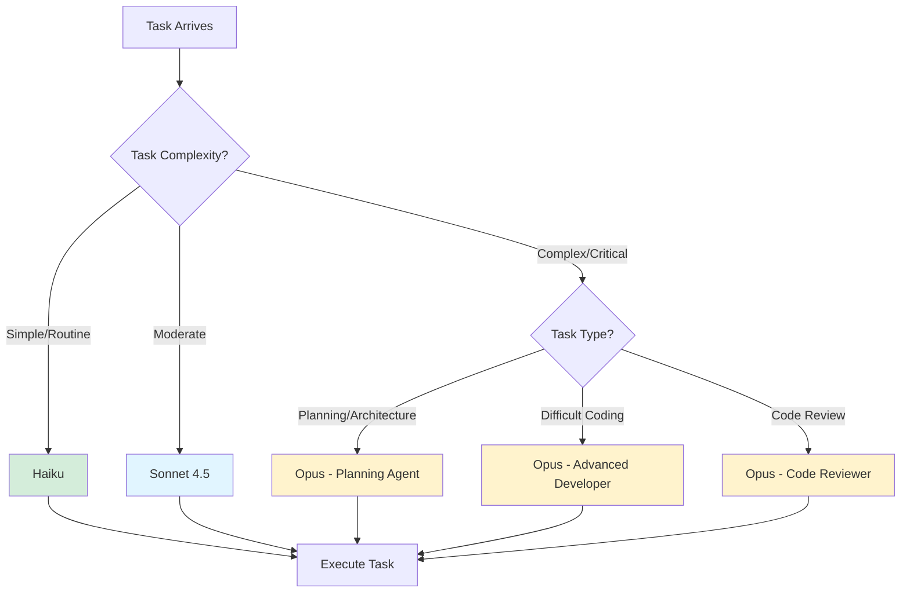
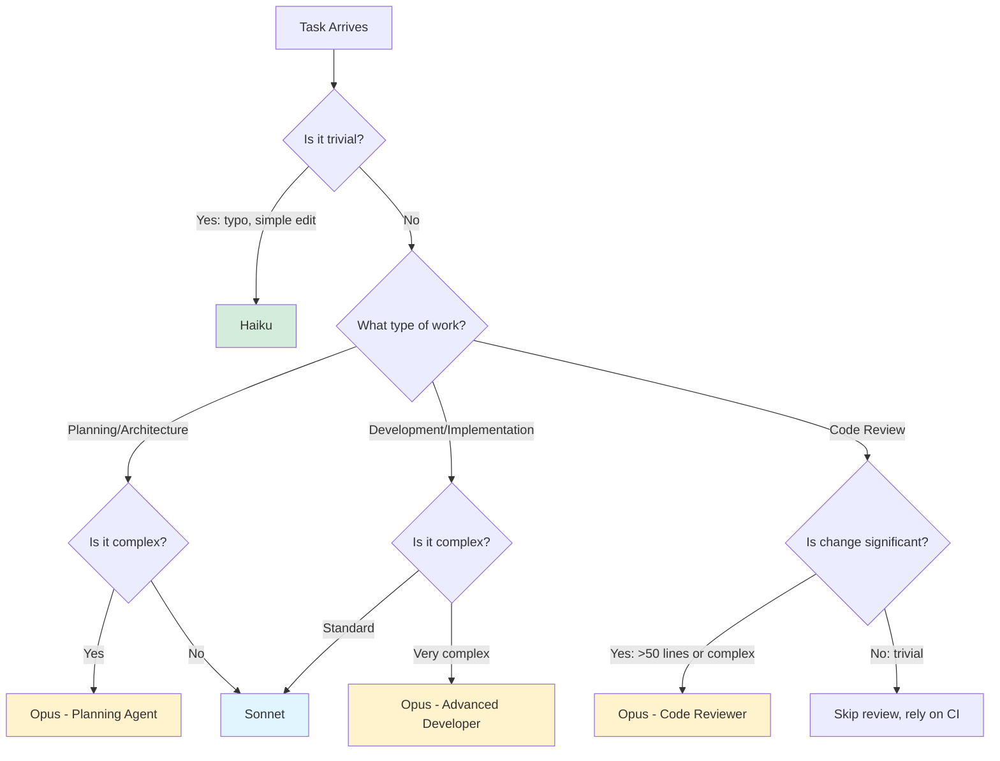

# Competency Management and Agent Matrix

**Project:** GL.iNet Comet GPL Compliance Analysis
**Version:** 1.1
**Effective Date:** 2025-12-12
**Last Updated:** 2025-12-12
**Review Frequency:** Annually

---

## Purpose

This document defines the competency requirements for personnel (human and AI agents) working on the GL.iNet Comet GPL Compliance Analysis project, in accordance with ISO 9001:2015 Clause 7.2. It establishes how we determine, provide, and verify competence for work affecting quality.

**ISO 9001:2015 Requirement:**
> The organization shall:
> - Determine the necessary competence of person(s) doing work under its control
> - Ensure these persons are competent on the basis of appropriate education, training, or experience
> - Take actions to acquire necessary competence
> - Retain appropriate documented information as evidence of competence

---

## Competency Framework

### What is Competence?

**Competence** = Education + Training + Skills + Experience

For this project:
- **Education:** Understanding of reverse engineering, GPL licensing, software development
- **Training:** Familiarity with project tools and methodology
- **Skills:** Ability to perform specific technical tasks
- **Experience:** Track record of successful task completion

### Competency Levels

| Level | Definition | Characteristics |
|-------|-----------|-----------------|
| **Expert** | Can handle most complex tasks independently | Deep knowledge, creative problem-solving, can teach others |
| **Advanced** | Can handle complex tasks with minimal guidance | Strong knowledge, reliable execution, few errors |
| **Intermediate** | Can handle routine tasks independently | Working knowledge, occasional guidance needed |
| **Novice** | Can handle simple tasks with guidance | Learning, requires supervision |
| **Not Applicable** | Cannot perform this task | Outside scope of capability |

---

## Human Developer Competencies

### Primary Developer (Project Lead)

**Role:** Overall project management, technical leadership, quality oversight

**Required Competencies:**

| Competency Area | Level Required | Verification Method |
|----------------|----------------|---------------------|
| **Reverse Engineering** | Advanced | Prior firmware analysis work |
| **GPL Compliance** | Advanced | Legal research, compliance analysis |
| **Python Development** | Advanced | Code in repository |
| **Bash Scripting** | Intermediate | Scripts in repository |
| **Git/Version Control** | Advanced | Commit history |
| **Black Box Methodology** | Expert | Methodology documentation |
| **Firmware Analysis Tools** | Advanced | Tool usage in scripts (binwalk, etc.) |
| **Documentation** | Advanced | Wiki and docs quality |
| **Quality Management** | Intermediate | QMS implementation |
| **AI Agent Orchestration** | Intermediate | Effective agent delegation |

**Evidence of Competence:**
- Repository commit history
- Documented methodology (CLAUDE.md)
- Successful GPL analysis results
- QMS documentation quality
- Effective agent task delegation

**Competency Gaps:**
- None identified for current scope

**Development Plan:**
- Maintain competence through continuous project work
- Annual review of ISO 9001 requirements
- Stay current on GPL enforcement landscape

---

## Maintainer Profiles

### Overview

This section tracks maintainer competency profiles for both human and AI collaboration purposes. Each maintainer has a **dual profile system** per [USER-PROFILE-SCHEMA.md](USER-PROFILE-SCHEMA.md):

1. **Agent Reference Profile** (`.claude/agents/<username>.md`) - AI agent collaboration context
2. **QMS Competency Profile** (`docs/quality/maintainers/<username>.md`) - ISO 9001 evidence

**Purpose:**
- Enable expertise-weighted AI agent collaboration (defer to experts, lead novices)
- Provide QMS evidence of competence (ISO 9001:2015 Clause 7.2)
- Establish communication preferences and authority boundaries
- Track competency development over time

**Onboarding:** New maintainers follow [ONBOARDING-PROCESS.md](ONBOARDING-PROCESS.md) to create profiles.

### Current Maintainers

| Maintainer | Role | Agent Reference | QMS Profile | Status | Last Review |
|------------|------|-----------------|-------------|--------|-------------|
| *[No maintainers fully onboarded yet]* | - | - | - | - | - |

**Status Legend:**
- 🟢 Active - Profile current and accurate
- 🟡 Review Needed - Profile requires update
- 🔴 Stale - Profile significantly outdated
- ⏸️ Inactive - Maintainer not currently active

**Note:** Maintainer profiles will be added as the onboarding process (Issue #67+) is completed.

### Profile Format

Each maintainer has **two profile files** that serve different purposes:

#### Agent Reference Profile (`.claude/agents/<username>.md`)

**Purpose:** AI agent collaboration context (read by main agent for initialization)

**Format:** YAML frontmatter + Markdown

**Contents:**
- Technical expertise by domain (Expert/Advanced/Intermediate/Novice)
- When to defer vs. challenge guidelines
- Communication preferences (Completed Staff Work, detail level, escalation)
- Authority boundaries (must decide, may decide, autonomous)
- Evidence base summary

**Audience:** AI agents (main agent reads this to understand how to collaborate)

**Example:**
```yaml
---
name: User Name
type: maintainer
user: username
last_updated: YYYY-MM-DD
---

# Technical Expertise
## Expert Domains
- Reverse Engineering
- GPL Compliance
...
```

See [USER-PROFILE-SCHEMA.md](USER-PROFILE-SCHEMA.md) Section 4.1 for complete structure.

#### QMS Competency Profile (`docs/quality/maintainers/<username>.md`)

**Purpose:** ISO 9001 competency evidence and development tracking

**Format:** Markdown with structured sections

**Contents:**
- Competency assessment table (domain → level → evidence → verification)
- Evidence of competence (commit analysis, key contributions, external portfolio)
- Self-declared competencies (background, training, experience)
- Competency gaps and development plan
- Communication preferences
- Authority and decision rights
- Review history table

**Audience:** Auditors, project lead, annual reviews

**Example:**
```markdown
# Maintainer Profile: [Name]

## Competency Assessment
| Domain | Level | Evidence | Verification |
|--------|-------|----------|--------------|
| Reverse Engineering | Expert | [Links] | [Method] |
...
```

See [USER-PROFILE-SCHEMA.md](USER-PROFILE-SCHEMA.md) Section 4.2 for complete structure.

### Profile Review Process

**Review Frequency:**
- **Quarterly:** Management Review Section 6.1.1 - Quick accuracy check
- **Annual:** Competency Matrix annual review - Deep competency assessment

**Quarterly Review (Management Review):**
- Profile accuracy check (expertise levels current?)
- Collaboration effectiveness (AI agent patterns working?)
- Identify needed updates (new competencies, changed preferences)
- Quick adjustments to profiles as needed

See [MANAGEMENT-REVIEW-TEMPLATE.md](MANAGEMENT-REVIEW-TEMPLATE.md) Section 6.1.1 for quarterly review checklist.

**Annual Review (This Document):**
- Comprehensive competency reassessment
- Evidence refresh (new projects, certifications, portfolio)
- Competency gap analysis
- Development plan update
- Profile major revisions if needed

**Review Triggers (Ad-Hoc):**
- Major role change (new responsibilities)
- Significant skill development (new certification, training)
- Collaboration issues identified (friction, miscommunication)
- User request (maintainer feels profile inaccurate)

### Evidence Sources and Retention

**Acceptable Evidence:**
- **External GitHub repositories** (NOT this AI-assisted repo)
- **Resume/CV** (professional background, education, certifications)
- **Self-assessment interview** (user's expertise declarations)
- **External portfolio** (open source contributions, publications)
- **Professional certifications** (technical, security, management)

**Evidence Retention:**
- Agent reference profiles: Permanent (version controlled in `.claude/agents/`)
- QMS profiles: Permanent (version controlled in `docs/quality/maintainers/`)
- Evidence links: Maintained in QMS profiles (external URLs preserved)
- Review history: Tracked in QMS profiles (table format)

### Integration with Collaboration Framework

**Expertise-Weighted Collaboration:**

AI agents adjust behavior based on maintainer's competency level in each domain:

| Competency Level | AI Agent Behavior | Example |
|-----------------|-------------------|---------|
| **Expert** | Defer to maintainer | "You mentioned using X approach. Should I proceed with that, or would you prefer Y?" |
| **Advanced** | Collaborate actively | "I recommend approach X because of Y. What do you think?" |
| **Intermediate** | Lead with oversight | "I'll use approach X (reasoning). Let me know if you'd like a different approach." |
| **Novice** | Agent leads, teaches | "I'll implement X. Here's why this approach works best..." |

**Authority Boundaries:**

Profiles define decision rights for each maintainer:

- **Must Decide:** User approval required (e.g., architecture decisions, security changes)
- **May Decide:** User can override agent (e.g., implementation details, refactoring)
- **Autonomous:** Agent decides independently (e.g., test writing, documentation)

See [USER-PROFILE-SCHEMA.md](USER-PROFILE-SCHEMA.md) Section 3.4 for complete authority framework.

### Onboarding New Maintainers

**Process:** Follow [ONBOARDING-PROCESS.md](ONBOARDING-PROCESS.md)

**Steps:**
1. Evidence collection (external repos, resume, portfolio)
2. Self-assessment interview
3. Competency mapping (external evidence → verified levels)
4. Communication preferences capture
5. Authority boundary definition
6. Create both profile files (agent reference + QMS)
7. Add to Maintainer Profiles table (above)
8. Initial validation (test AI agent collaboration)

**Quality Control:**
- Evidence must be from external sources (not this AI-assisted repo)
- Competency levels must be verifiable from evidence
- Both profiles must be consistent
- Profiles must pass schema validation

**First Onboarding:** Issue #67 will complete stvhay onboarding, validating this framework.

---

## AI Agent Competencies

### Agent Competency Model

AI agents have different competency profiles than humans:
- **Strengths:** Consistency, tirelessness, instant recall, broad knowledge
- **Limitations:** No true understanding, context window limits, occasional hallucinations
- **Verification:** Output quality, test results, code review

### Model Selection Strategy



---

## Agent 1: Primary Development Agent

### Configuration

**Agent Name:** Primary Development Agent
**Model:** Claude Sonnet 4.5 (claude-sonnet-4-5-20250929)
**Configuration File:** N/A (default agent)
**Cost Tier:** Medium

### Role Definition

**Purpose:** Routine development work including analysis scripts, tests, documentation, and general problem-solving.

**Typical Tasks:**
- Writing new analysis scripts
- Creating test suites
- Generating documentation
- Refactoring code
- Debugging routine issues
- Responding to user queries
- Implementing defined specifications

**NOT For:**
- Extremely complex algorithms
- Critical architectural decisions (without review)
- Deep security analysis
- Novel research problems

### Competency Profile

| Competency Area | Level | Notes |
|----------------|-------|-------|
| **Python Development** | Advanced | Strong code generation, PEP 8 compliance |
| **Test Development** | Advanced | pytest, coverage, mocking |
| **Bash Scripting** | Intermediate | Basic scripts, shellcheck compliance |
| **Documentation Writing** | Advanced | Clear, comprehensive, markdown |
| **Debugging** | Advanced | Systematic problem isolation |
| **Refactoring** | Intermediate | Pattern extraction, code cleanup |
| **API Design** | Intermediate | Function signatures, module structure |
| **Git Operations** | Intermediate | Commits, basic workflows |
| **Black Box Methodology** | Advanced | Understands traceability requirements |
| **Tool Usage** | Advanced | binwalk, strings, dtc, pytest, ruff |
| **Problem Solving** | Advanced | Breaks down problems systematically |
| **Following Instructions** | Expert | Excellent adherence to specifications |

### Selection Criteria

**Use Sonnet When:**
- Task is well-defined with clear requirements
- Standard development practices apply
- Cost efficiency is important (vs. Opus)
- Task doesn't require deepest reasoning
- Routine analysis or documentation work

**Don't Use Sonnet When:**
- Problem requires novel architecture design
- Deep security implications
- Extremely complex algorithmic challenges
- Critical code that requires Opus-level review

### Verification Methods

**Output Quality:**
- Code passes all tests (619+ tests)
- Zero linting errors (ruff check)
- Proper formatting (ruff format)
- Source metadata present in analysis results

**Effectiveness Metrics:**
- Test success rate: >99%
- First-time code quality: >95% (passes CI without fixes)
- Documentation completeness: High (subjective review)
- Task completion rate: >95%

**Review Frequency:** Ongoing (every task)

---

## Agent 2: Advanced Developer Agent

### Configuration

**Agent Name:** Advanced Developer Agent
**Model:** Claude Opus 4.5 (claude-opus-4-5-20251101)
**Configuration File:** `.claude/agents/advanced-developer` (future)
**Cost Tier:** High

### Role Definition

**Purpose:** Handle complex coding challenges that require deep reasoning, novel algorithms, or sophisticated architectural design.

**Typical Tasks:**
- Designing complex refactoring strategies
- Implementing novel algorithms
- Solving difficult technical problems
- Architectural decisions with multiple trade-offs
- Performance-critical optimizations
- Complex data structure design

**NOT For:**
- Simple code edits (use Haiku)
- Routine development (use Sonnet)
- Planning/architecture design (use Planning Agent)

### Competency Profile

| Competency Area | Level | Notes |
|----------------|-------|-------|
| **Python Development** | Expert | Advanced patterns, optimization |
| **Algorithm Design** | Expert | Novel approaches, efficiency |
| **Complex Refactoring** | Expert | Large-scale restructuring |
| **Performance Optimization** | Advanced | Profiling, algorithmic improvements |
| **Design Patterns** | Advanced | Appropriate pattern selection |
| **Data Structures** | Expert | Complex structure design |
| **Debugging** | Expert | Deep issue investigation |
| **Code Architecture** | Advanced | Module design, dependency management |
| **Problem Solving** | Expert | Creative solutions to hard problems |

### Selection Criteria

**Use Opus (Advanced Developer) When:**
- Problem is genuinely complex (not just large)
- Sonnet has struggled or failed
- Novel algorithm design required
- Performance is critical
- Architectural complexity is high
- Deep reasoning would save significant rework

**Don't Use Opus When:**
- Sonnet can handle it (cost efficiency)
- Planning/architecture design (use Planning Agent instead)
- Code review (use Code Reviewer Agent instead)
- Simple tasks (massive overkill)

### Verification Methods

**Output Quality:**
- Solves problems Sonnet cannot
- Code is maintainable and well-architected
- Performance improvements measurable
- Minimal need for follow-up fixes

**Effectiveness Metrics:**
- Problem resolution rate: >90% (for genuinely hard problems)
- Code quality: Exceptional (subjective)
- Performance improvement: Measurable when applicable

**Review Frequency:** Per usage (high-cost agent)

---

## Agent 3: Planning Agent

### Configuration

**Agent Name:** Planning Agent
**Model:** Claude Opus 4.5 (claude-opus-4-5-20251101)
**Configuration File:** `.claude/agents/planning` (future)
**Cost Tier:** High

### Role Definition

**Purpose:** Strategic planning, work breakdown, implementation strategy design, and architectural planning.

**Typical Tasks:**
- Breaking down complex features into tasks
- Designing implementation strategies
- Creating phased rollout plans
- Architectural design and trade-off analysis
- Process improvement planning
- Risk identification in planning phase

**NOT For:**
- Implementation (use Developer agents)
- Code review (use Code Reviewer Agent)
- Simple task planning (use Sonnet)

### Competency Profile

| Competency Area | Level | Notes |
|----------------|-------|-------|
| **Strategic Thinking** | Expert | Long-term vision, trade-offs |
| **Work Breakdown** | Expert | Clear, actionable task decomposition |
| **Architectural Design** | Expert | System-level thinking |
| **Design Patterns** | Advanced | Pattern selection and application |
| **Risk Identification** | Advanced | Proactive problem anticipation |
| **Phased Planning** | Expert | Incremental delivery strategies |
| **Dependency Analysis** | Advanced | Task ordering, blockers |
| **Trade-off Analysis** | Expert | Balancing competing concerns |
| **Documentation** | Advanced | Clear plan documentation |

### Selection Criteria

**Use Planning Agent When:**
- Feature is complex with multiple approaches
- Architectural decisions required
- Multiple phases/stages needed
- Trade-offs need deep analysis
- Risk identification important before implementation
- Implementation strategy unclear

**Don't Use Planning Agent When:**
- Plan is straightforward (use Sonnet)
- Just need implementation (use Developer agents)
- Simple task breakdown

### Verification Methods

**Output Quality:**
- Plans are actionable and clear
- Risks identified upfront
- Trade-offs well-analyzed
- Implementation proceeds smoothly from plan

**Effectiveness Metrics:**
- Plan completeness: High (subjective)
- Implementation success: Plans lead to successful execution
- Risk prevention: Identified risks avoided

**Review Frequency:** Per planning task

---

## Agent 4: Code Reviewer Agent

### Configuration

**Agent Name:** Code Reviewer Agent
**Model:** Claude Opus 4.5 (claude-opus-4-5-20251101)
**Configuration File:** `.claude/agents/code-reviewer`
**Cost Tier:** High

### Role Definition

**Purpose:** Thorough code review, security analysis, bug detection, and quality validation for significant code changes.

**Typical Tasks:**
- Reviewing significant code changes (>50 lines)
- Security vulnerability analysis
- Best practices validation
- Bug detection before merge
- Architecture review
- Performance review

**NOT For:**
- Trivial changes (typos, formatting)
- Routine code that passes automated checks
- Implementation work (use Developer agents)

### Competency Profile

| Competency Area | Level | Notes |
|----------------|-------|-------|
| **Code Analysis** | Expert | Deep understanding of code quality |
| **Security Analysis** | Advanced | Vulnerability identification |
| **Best Practices** | Expert | Language-specific best practices |
| **Bug Detection** | Expert | Subtle issue identification |
| **Architecture Review** | Advanced | System-level code quality |
| **Performance Analysis** | Advanced | Performance issue identification |
| **Test Coverage Review** | Advanced | Adequacy of test suites |
| **Documentation Review** | Advanced | Code clarity and comments |

### Selection Criteria

**Use Code Reviewer When:**
- Code change is significant (>50 lines or complex logic)
- Security implications exist
- Architectural changes made
- Before merge to main (for major features)
- High-risk code (firmware extraction, parsing)

**Don't Use Code Reviewer When:**
- Change is trivial (typo fix, comment update)
- Automated checks are sufficient
- Cost not justified for simple change

### Verification Methods

**Output Quality:**
- Identifies real issues (not false positives)
- Suggestions improve code quality
- Security issues caught before deployment
- Review feedback is actionable

**Effectiveness Metrics:**
- Bug catch rate: Issues found that would have caused problems
- False positive rate: Low (<10%)
- Review thoroughness: High (subjective)

**Review Frequency:** Per code review (triggered by significant changes)

---

## Agent 5: Quick Task Agent

### Configuration

**Agent Name:** Quick Task Agent
**Model:** Claude Haiku (claude-haiku-3-5-20241022)
**Configuration File:** `.claude/agents/quick-task`
**Cost Tier:** Low

### Role Definition

**Purpose:** Fast, cost-effective execution of simple, well-defined tasks.

**Typical Tasks:**
- Fixing typos in documentation
- Simple text edits
- Basic file operations (rename, move)
- Running simple commands
- Quick file lookups
- Trivial code fixes (single-line changes)

**NOT For:**
- Complex development work
- Tasks requiring reasoning
- Multi-step processes
- Anything requiring Sonnet or Opus capabilities

### Competency Profile

| Competency Area | Level | Notes |
|----------------|-------|-------|
| **Text Editing** | Intermediate | Simple find/replace, typo fixes |
| **File Operations** | Intermediate | Basic file manipulation |
| **Command Execution** | Intermediate | Simple bash commands |
| **Following Instructions** | Advanced | Excellent for simple tasks |
| **Speed** | Expert | Very fast execution |
| **Cost Efficiency** | Expert | Minimal cost per task |

### Selection Criteria

**Use Haiku When:**
- Task is trivial and well-defined
- No reasoning required
- Speed matters
- Cost optimization important
- Task description is crystal clear

**Don't Use Haiku When:**
- Task requires any complexity
- Context understanding needed
- Multi-step reasoning required
- Task description is ambiguous

### Verification Methods

**Output Quality:**
- Task completed correctly
- No unintended side effects
- Instructions followed precisely

**Effectiveness Metrics:**
- Task completion accuracy: >95%
- Speed: Very fast
- Cost: Minimal

**Review Frequency:** Per task (spot check)

---

## Agent Selection Decision Tree



---

## Competency Verification

### Verification Methods by Agent Type

**Human Developer:**
- Portfolio review (repository quality)
- Peer feedback (when available)
- Output quality assessment
- Self-assessment against competency matrix

**AI Agents:**
- Output quality metrics (tests passing, linting, etc.)
- Task completion rates
- Error/retry rates
- Cost-effectiveness analysis
- Spot checks by human lead

### Verification Schedule

| Role | Verification Frequency | Method |
|------|----------------------|---------|
| Human Developer | Annually | Self-assessment + portfolio review |
| Primary Development Agent | Continuous | Automated quality gates |
| Advanced Developer Agent | Per usage | Human review of outputs |
| Planning Agent | Per usage | Plan quality assessment |
| Code Reviewer Agent | Per usage | Review effectiveness tracking |
| Quick Task Agent | Spot checks | Random task verification |

---

## Competency Gaps and Development

### Identified Gaps

**Human Developer:**
- None identified for current scope
- Future: May need deeper AI orchestration skills if project scales

**AI Agents:**
- Model updates may require re-verification
- New models (e.g., Opus 5.0, Sonnet 5.0) require capability assessment

### Development Actions

**When Agent Model Updates:**
1. Review release notes for capability changes
2. Test agent with sample tasks from each competency area
3. Update competency matrix if capabilities change
4. Adjust selection criteria if needed

**When New Agent Roles Needed:**
1. Define role and purpose
2. Assess required competencies
3. Select appropriate model
4. Document in this matrix
5. Verify with test tasks

---

## Competency Records

### Evidence of Competence (ISO 9001 Requirement)

**Human Developer:**
- This competency matrix (assessment)
- Repository contribution history (Git log)
- QMS documentation quality
- Successful project milestones

**AI Agents:**
- Agent model specifications (documented in this matrix)
- Task success metrics (CI/CD logs, test results)
- Configuration files (`.claude/agents/`)
- Cost-effectiveness analysis (usage logs)

**Record Retention:**
- Competency matrix: Permanent (version controlled)
- Model specifications: Permanent (documented here)
- Verification logs: 3 years (CI/CD logs)
- Cost analysis: Annual summary (management review)

---

## Annual Review Process

### Review Checklist

**Conducted:** Annually (next review: 2025-12-12)
**Reviewed By:** Project Lead

**Review Questions:**
- [ ] Are defined competencies still appropriate for project needs?
- [ ] Have any competency gaps been identified?
- [ ] Are maintainer profiles accurate and up-to-date?
- [ ] Are agent model selections still optimal?
- [ ] Have model updates changed agent capabilities?
- [ ] Is verification process effective?
- [ ] Are cost vs. capability trade-offs appropriate?
- [ ] Do we need new agent roles?
- [ ] Are agent selection criteria clear and followed?
- [ ] Is expertise-weighted collaboration working effectively?

**Review Inputs:**
- Agent usage statistics (tasks by agent type)
- Cost analysis (spend by agent)
- Quality metrics (test success rates, bug rates)
- New model availability (Anthropic releases)
- Project scope changes

**Review Outputs:**
- Updated competency matrix (this document)
- Agent configuration changes (if needed)
- Training/development actions
- Agent selection criteria refinements

---

## Integration with QMS

### Links to Other QMS Documents

**Quality Policy:**
- Commitment 5: Competence and Resource Management
- Ensures appropriate agent model selection based on task complexity

**Quality Objectives:**
- Objective 4: Code Quality - Agent competence drives quality
- Objective 5: Continuous Improvement - Regular competency review

**Procedures:**
- P1: Analysis Script Development - Agent selection integrated
- P3: Quality Assurance - Verification methods defined

**Management Review:**
- Section 6.1.1: Maintainer Profile Review - Quarterly profile accuracy check
- Section 6.1.2: General Human Resources - Competency adequacy assessed
- Section 6.2: AI Agent Resources - Agent effectiveness reviewed quarterly

**Risk Register:**
- R7: Resource/Time Constraints - Agent competency affects capacity

---

## Approval and Maintenance

**Approved By:** Project Lead
**Date:** 2025-12-12
**Next Review:** 2026-12-12

**Revision History:**

| Version | Date | Changes | Author |
|---------|------|---------|--------|
| 1.1 | 2025-12-12 | Added Maintainer Profiles section with dual profile system | Project Lead |
| 1.0 | 2025-12-12 | Initial competency matrix with 5 agent roles | Project Lead |

---

## References

- ISO 9001:2015, Clause 7.2 - Competence
- [Quality Policy](QUALITY-POLICY.md) - Commitment 5 (Competence)
- [User Profile Schema](USER-PROFILE-SCHEMA.md) - Maintainer profile structure
- [Onboarding Process](ONBOARDING-PROCESS.md) - New maintainer onboarding
- [Management Review Template](MANAGEMENT-REVIEW-TEMPLATE.md) - Section 6.1.1 (Quarterly profile review)
- [CLAUDE.md](../../CLAUDE.md) - Agent delegation guidance
- [Anthropic Model Documentation](https://docs.anthropic.com/en/docs/models-overview)

---

*This competency matrix is a living document that evolves with project needs, model capabilities, and team composition. All changes are version-controlled and reviewed annually.*
