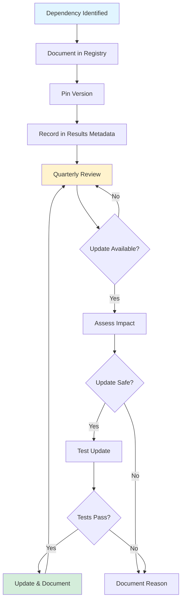

# Dependency Control and Tracking

**Project:** GL.iNet Comet GPL Compliance Analysis
**Version:** 1.0
**Effective Date:** 2025-12-12
**Last Updated:** 2025-12-12
**Review Frequency:** Quarterly

---

## Purpose

This document defines how dependencies (tools, firmware, libraries) are controlled and tracked for the GL.iNet Comet GPL Compliance Analysis project, in accordance with ISO 9001:2015 Clauses 7.1.5 (Monitoring and Measuring Resources) and 8.4 (Control of Externally Provided Processes, Products and Services).

**Why This Matters:**
- **Reproducibility:** Analysis results must be reproducible with the same tools
- **Traceability:** Know which tool versions produced which results
- **Change Management:** Understand impact of dependency updates
- **Risk Management:** Mitigate supply chain risks (R3)

---

## Dependency Categories

### 1. Development Environment Dependencies

**Managed By:** Nix flake (`flake.nix`)
**Update Frequency:** As needed, quarterly review
**Verification:** `nix flake check`

**Categories:**
- **Core Language:** Python 3.11
- **Analysis Tools:** binwalk, unsquashfs, dtc, strings, xxd, file
- **Development Tools:** pytest, ruff, mypy, coverage
- **Python Libraries:** See `flake.nix` for complete list

**Version Control Method:** Cryptographic hashes in `flake.lock`

### 2. Analysis Target Dependencies

**Managed By:** Documentation and results metadata
**Update Frequency:** Per firmware release
**Verification:** Checksum validation

**Categories:**
- **Firmware Images:** GL.iNet Comet firmware files
- **Extracted Components:** Kernels, rootfs, bootloaders

**Version Control Method:** SHA256 checksums documented

### 3. CI/CD Dependencies

**Managed By:** GitHub Actions workflows
**Update Frequency:** Follow GitHub's recommendations
**Verification:** CI pipeline success

**Categories:**
- **GitHub Actions:** actions/checkout, actions/setup-python, etc.
- **Nix Action:** cachix/install-nix-action

**Version Control Method:** Pinned versions in `.github/workflows/`

### 4. Documentation Dependencies

**Managed By:** Nix flake
**Update Frequency:** As needed
**Verification:** Template rendering success

**Categories:**
- **Jinja2:** Template engine
- **Markdown:** Documentation format
- **TOML:** Results format parser

**Version Control Method:** Nix flake pinning

---

## Dependency Tracking Process

### Process Flow



---

## Nix Flake Management

### Current Dependency Versions

**Retrieving Current Versions:**
```bash
# Show all package versions
nix flake metadata

# Show specific package version
nix eval .#python3.version --raw

# Show all inputs
nix flake show

# Show lock file (pinned versions)
cat flake.lock
```

**Key Dependencies (Examples):**
```nix
# From flake.nix
{
  python3 = pkgs.python311;  # Python 3.11.x
  binwalk = pkgs.binwalk;    # Latest stable
  squashfs = pkgs.squashfsTools;
  # ... (see flake.nix for complete list)
}
```

### Flake Lock File

**Purpose:** `flake.lock` pins all dependencies with cryptographic hashes

**Example Entry:**
```json
{
  "nixpkgs": {
    "locked": {
      "lastModified": 1234567890,
      "narHash": "sha256-ABC123...",
      "rev": "abc123def456",
      "type": "github",
      "owner": "NixOS",
      "repo": "nixpkgs"
    }
  }
}
```

**Verification:**
```bash
# Verify flake integrity
nix flake check

# Update flake lock (when intentional)
nix flake update

# Update specific input
nix flake update nixpkgs
```

### Version Documentation in Results

**Required in Analysis Metadata:**
All analysis results (`results/*.toml`) must include environment section:

```toml
[_environment]
python_version = "3.11.14"
binwalk_version = "2.3.4"
nix_flake_rev = "abc123def456"
analysis_date = "2025-12-12"
```

**Implementation:**
Analysis scripts should capture environment info:

```python
import sys
import subprocess

def get_environment_metadata():
    """Capture environment for reproducibility."""
    return {
        "_environment": {
            "python_version": sys.version.split()[0],
            "nix_flake_rev": get_git_rev(),
            "analysis_date": datetime.now().isoformat(),
            # Add tool versions as needed
        }
    }

def get_git_rev():
    """Get current git revision."""
    result = subprocess.run(
        ["git", "rev-parse", "HEAD"],
        capture_output=True,
        text=True,
        check=True
    )
    return result.stdout.strip()[:12]  # Short hash
```

---

## Firmware Version Tracking

### Firmware Registry

**Current Firmware:**
- **Device:** GL.iNet Comet (RM1)
- **Version:** 1.7.2-1128
- **Release Date:** 2024-11-28
- **Download URL:** https://fw.gl-inet.com/kvm/rm1/release/glkvm-RM1-1.7.2-1128-1764344791.img
- **SHA256:** (To be documented on first download)
- **File Size:** (To be documented)

**Verification Command:**
```bash
# Calculate checksum
sha256sum firmware/glkvm-RM1-1.7.2-1128-1764344791.img

# Verify checksum
echo "<expected-sha256>  firmware/glkvm-RM1-1.7.2-1128-1764344791.img" | sha256sum -c
```

### Firmware Chain of Custody

**Documentation Required:**
1. Download date and time
2. Download source (URL)
3. Checksum calculation
4. Storage location
5. Analysis start date

**Record Location:** `docs/firmware-registry.md` (to be created)

**Template:**
```markdown
## Firmware: GL.iNet Comet 1.7.2-1128

**Download Information:**
- Date: YYYY-MM-DD
- URL: https://fw.gl-inet.com/kvm/rm1/release/glkvm-RM1-1.7.2-1128-1764344791.img
- Downloaded By: [Name/Tool]

**Verification:**
- SHA256: [hash]
- Verified: YYYY-MM-DD
- Method: sha256sum

**Storage:**
- Location: firmware/glkvm-RM1-1.7.2-1128-1764344791.img
- Backup: [Location if applicable]

**Analysis:**
- First Analyzed: YYYY-MM-DD
- Scripts Used: [List of analysis scripts]
- Results: results/[various].toml
```

### New Firmware Release Process

**When GL.iNet Releases New Firmware:**

1. **Detection:**
   - Monitor https://fw.gl-inet.com/kvm/rm1/release/
   - Check for new version numbers
   - Subscribe to GL.iNet announcements (if available)

2. **Download and Verification:**
   ```bash
   # Download
   curl -O https://fw.gl-inet.com/kvm/rm1/release/[new-firmware].img

   # Calculate checksum
   sha256sum [new-firmware].img

   # Document in firmware registry
   ```

3. **Impact Assessment:**
   - Will existing analysis scripts work?
   - Are there new components to analyze?
   - Do we need new analysis scripts?

4. **Analysis:**
   - Re-run all analysis scripts on new firmware
   - Compare results to previous version
   - Document changes

5. **Documentation:**
   - Update firmware registry
   - Update results with new firmware version
   - Document any methodology changes

---

## Change Management Process

### When to Update Dependencies

**Triggers for Dependency Updates:**
1. **Security Vulnerabilities:** Immediate update if critical
2. **Bug Fixes:** Update if bug affects our analysis
3. **New Features:** Update if feature improves analysis
4. **Quarterly Review:** Proactive update check

**When NOT to Update:**
- Update breaks existing functionality
- Update provides no benefit
- Risk exceeds benefit (stability concerns)

### Change Assessment Template

**Before Any Dependency Update:**

```markdown
## Dependency Update Assessment

**Dependency:** [Package name]
**Current Version:** [version]
**Proposed Version:** [new version]
**Date:** YYYY-MM-DD

### Reason for Update
- [ ] Security vulnerability (CVE-YYYY-XXXXX)
- [ ] Bug fix affecting our usage
- [ ] New feature we need
- [ ] Quarterly maintenance
- [ ] Other: [explain]

### Impact Assessment

**What could break:**
- [List potential issues]

**Testing required:**
- [ ] Unit tests pass
- [ ] Integration tests pass
- [ ] Manual verification: [describe]

**Risk Level:** ☐ Low ☐ Medium ☐ High

**Rollback Plan:**
- Method: `git revert [commit]` or `nix flake lock --update-input [input] [old-rev]`
- Verification: [how to verify rollback worked]

### Approval

**Decision:** ☐ Approved ☐ Rejected ☐ Deferred
**Reason:** [Brief justification]
**Approved By:** [Name]
**Date:** YYYY-MM-DD
```

### Change Implementation

**Standard Update Process:**

1. **Create Branch:**
   ```bash
   git checkout -b update/[dependency]-[new-version]
   ```

2. **Update Dependency:**
   ```bash
   # For nix flake
   nix flake update [input]

   # For Python packages (if not using nix)
   # Update version in requirements or flake.nix
   ```

3. **Test:**
   ```bash
   # Run full test suite
   pytest

   # Verify specific functionality if applicable
   ./scripts/[affected-script].py
   ```

4. **Document:**
   - Commit message explains update and reason
   - Update CHANGELOG if maintained
   - Update dependency registry (this document)

5. **Commit:**
   ```bash
   git add flake.lock [other-files]
   git commit -m "chore: Update [dependency] from [old] to [new]

   Reason: [security/bugfix/feature/maintenance]
   Impact: [what changes]
   Testing: [what was tested]

   🤖 Generated with [Claude Code](https://claude.com/claude-code)"
   ```

6. **Verify:**
   - CI/CD passes
   - No regressions
   - Functionality works as expected

7. **Document:**
   - Update this document's "Recent Changes" section below
   - Note in quarterly management review

---

## Verification Procedures

### Dependency Integrity Verification

**Nix Flake Verification:**
```bash
# Verify all hashes in flake.lock
nix flake check

# Rebuild to ensure environment still works
nix develop

# Run tests to verify functionality
pytest
```

**Firmware Verification:**
```bash
# Verify firmware checksum
sha256sum -c firmware-checksums.txt

# Verify firmware hasn't been modified
stat firmware/[firmware-file].img  # Check modification time
```

### Reproducibility Verification

**Test:** Can someone else reproduce our results?

**Procedure:**
1. Clone repository
2. Run `nix develop`
3. Execute analysis scripts
4. Compare output to committed results

**Success Criteria:**
- Same tool versions loaded (from flake.lock)
- Scripts execute without errors
- Results match within expected variance

**Frequency:** Annually or after major updates

---

## Dependency Registry

### Current Dependencies (2025-12-12)

**Development Tools:**
| Tool | Version | Purpose | Update Frequency |
|------|---------|---------|------------------|
| Python | 3.11.14 | Language | Stable (no updates unless needed) |
| binwalk | 2.3.4+ | Firmware extraction | Quarterly review |
| squashfs-tools | 4.6+ | Filesystem extraction | Quarterly review |
| dtc | 1.7+ | Device tree compiler | Quarterly review |
| pytest | 8.4+ | Testing framework | Quarterly review |
| ruff | 0.9+ | Linting/formatting | Monthly (fast-moving) |

**Python Libraries:**
| Library | Purpose | Update Frequency |
|---------|---------|------------------|
| jinja2 | Template rendering | Quarterly |
| toml | Results parsing | Stable |
| pytest-cov | Coverage measurement | Quarterly |

**Analysis Targets:**
| Firmware | Version | Date Added | Checksum |
|----------|---------|------------|----------|
| GL.iNet Comet | 1.7.2-1128 | 2024-11-28 | [To be documented] |

**CI/CD:**
| Action | Version | Purpose |
|--------|---------|---------|
| actions/checkout | v4 | Repository checkout |
| cachix/install-nix-action | v27 | Nix installation |

---

## Recent Changes

### Change Log

| Date | Dependency | Old Version | New Version | Reason | Impact |
|------|-----------|-------------|-------------|--------|--------|
| 2025-12-12 | Documentation | - | Initial | First dependency registry | Baseline established |

---

## Quarterly Review Process

### Dependency Review Checklist

**Conducted:** Quarterly (aligned with Management Review)
**Next Review:** 2026-03-15

**Review Questions:**
- [ ] Are all dependencies still necessary?
- [ ] Are pinned versions current or outdated?
- [ ] Any security vulnerabilities in current versions?
- [ ] Any dependency updates available?
- [ ] Any deprecated dependencies to replace?
- [ ] Is firmware version still current?
- [ ] Are tool versions documented in results?

**Review Sources:**
- Nix package updates: https://search.nixos.org/packages
- Python security advisories: https://pypi.org/
- GL.iNet firmware releases: https://fw.gl-inet.com/
- GitHub Dependabot alerts (if enabled)

**Review Output:**
- List of dependencies to update
- Security issues to address
- Update plan with priorities
- Changes documented in this file

---

## Integration with QMS

### Links to Other Documents

**Risk Register:**
- R3: Dependency Supply Chain Risk
- This document provides mitigations for R3

**Quality Objectives:**
- Objective 2: Reproducibility
- Dependency control ensures 100% reproducibility

**Procedures:**
- P1: Analysis Script Development
- Scripts must document tool versions in results

**Management Review:**
- Section 6.3: Infrastructure Resources
- Dependency status reviewed quarterly

**Internal Audits:**
- Audit 2 Checklist includes dependency verification
- Verify tool versions documented in results

---

## Approval and Maintenance

**Approved By:** Project Lead
**Date:** 2025-12-12
**Next Review:** 2026-03-15 (quarterly)

**Revision History:**

| Version | Date | Changes | Author |
|---------|------|---------|--------|
| 1.0 | 2025-12-12 | Initial dependency tracking document | Project Lead |

---

## References

- ISO 9001:2015, Clause 7.1.5 - Monitoring and Measuring Resources
- ISO 9001:2015, Clause 8.4 - Control of Externally Provided Processes, Products and Services
- [Risk Register](RISK-REGISTER.md) - R3: Dependency Supply Chain Risk
- [Quality Objectives](QUALITY-OBJECTIVES.md) - Objective 2: Reproducibility
- [Nix Flake Documentation](https://nixos.org/manual/nix/stable/command-ref/new-cli/nix3-flake.html)

---

## Future Enhancements

**Potential Improvements:**
- Automated dependency vulnerability scanning
- Dependabot or Renovate bot integration
- Automated firmware release monitoring
- Tool version extraction automation
- Dependency graph visualization

**Priority:** Low (current manual process is adequate for project scale)

---

*Dependency control is critical for reproducibility. By documenting and tracking all dependencies, we ensure our analysis results can be independently verified years from now.*
