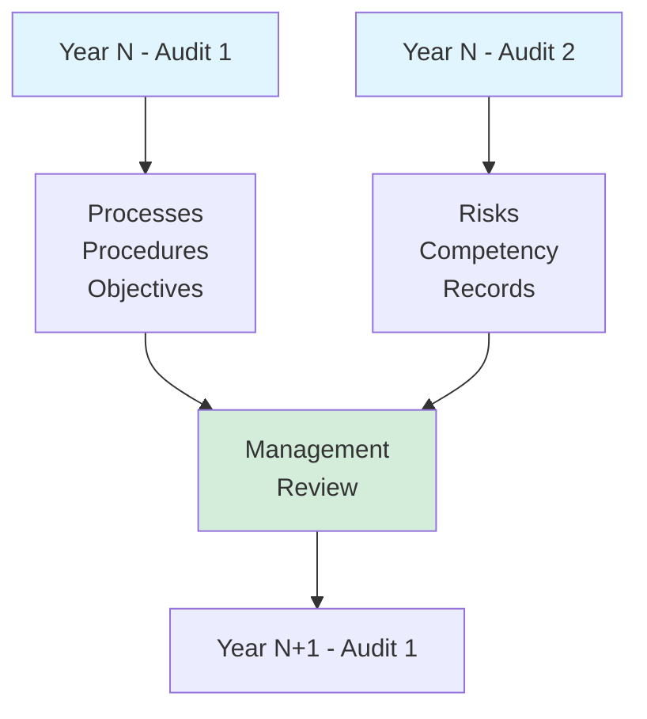
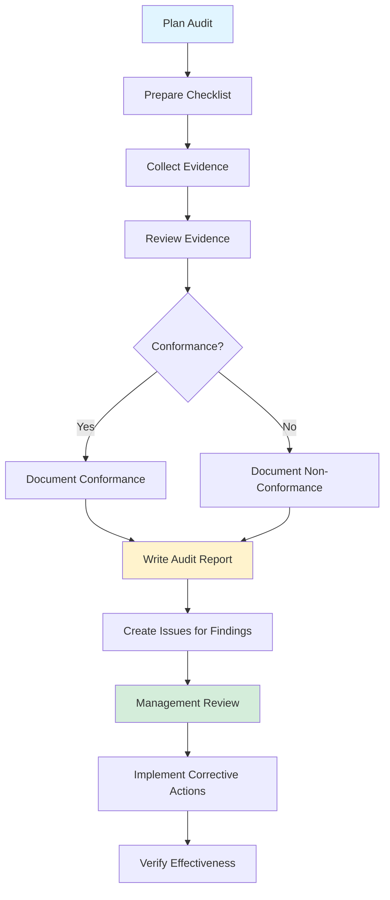

# Internal Audit Schedule and Process

**Project:** GL.iNet Comet GPL Compliance Analysis
**Version:** 1.1
**Effective Date:** 2025-12-12
**Last Updated:** 2025-12-12
**Review Frequency:** Semi-annually (2 audits/year) OR 910 AI work-hours per audit, whichever comes first

---

## Purpose

This document defines the internal audit process for the Quality Management System (QMS) in accordance with ISO 9001:2015 Clause 9.2. Internal audits ensure the QMS is:
- Conforming to ISO 9001:2015 requirements and project-specific QMS requirements
- Effectively implemented and maintained
- Producing intended results

**ISO 9001:2015 Requirement:**
> The organization shall conduct internal audits at planned intervals to provide information on whether the quality management system:
> a) conforms to the organization's own requirements for its quality management system and to the requirements of this International Standard;
> b) is effectively implemented and maintained.

---

## Audit Approach

### Lightweight Audit for 2-Person Team

Traditional ISO 9001 audits involve independent auditors examining multiple departments. For a 2-person team with AI assistance:

**Pragmatic Approach:**
- **Self-audit** by project lead with structured checklists
- **Process-focused** rather than people-focused
- **Evidence-based** using Git history, CI/CD logs, issue tracker
- **Improvement-oriented** rather than compliance-focused
- **2 audits/year** (minimum ISO requirement)
- **Dual-trigger system:** Calendar OR 910 AI work-hours, whichever comes first (see [QMS-SCOPE.md](QMS-SCOPE.md) Section 2.3)

**What Makes This Valid:**
- Structured, documented methodology
- Objective evidence reviewed (not just opinions)
- Findings tracked and addressed
- Management review of audit results
- Continuous improvement focus

---

## Audit Schedule

### Annual Audit Plan

| Audit | Quarter | Focus Areas | Typical Date |
|-------|---------|-------------|--------------|
| **Audit 1** | Q2 (Spring) | Processes, Procedures, Quality Objectives | Mid-April |
| **Audit 2** | Q4 (Fall) | Risk Management, Competency, Records | Mid-October |

**Next Scheduled Audits (Dual Triggers):**
- **Audit 1 (2026):** April 15, 2026 OR 910 AI work-hours from 2025-12-12, whichever comes first
- **Audit 2 (2026):** October 15, 2026 OR 910 AI work-hours from Audit 1, whichever comes first

**Work-Hour Tracking:**
- Cumulative AI work-hours tracked in each management review
- When 910 hours reached before scheduled date, audit triggered early
- After each audit, work-hour counter resets to zero

### Audit Scope Rotation



**3-Year Deep Dive Cycle:**
- **Year 1:** Focus on operational processes (P1-P4)
- **Year 2:** Focus on planning and improvement (Clause 6, 10)
- **Year 3:** Focus on resources and documentation (Clause 7, 8)

This ensures all QMS areas audited deeply over 3 years while maintaining 2 audits/year.

---

## Audit Process

### Process Flow



### Step-by-Step Procedure

#### Step 1: Plan Audit (1 hour)

**Action:** Schedule audit and define scope

**Inputs:**
- Audit schedule (this document)
- Previous audit report
- Management review minutes
- Recent issues/changes

**Tasks:**
- Set audit date (2 weeks notice minimum)
- Select audit focus areas from schedule
- Review previous audit findings
- Identify high-risk areas for deeper review
- Reserve time for audit (2-4 hours)

**Output:** Audit plan with scope and schedule

---

#### Step 2: Prepare Checklist (30 minutes)

**Action:** Create audit checklist from templates below

**Tasks:**
- Select relevant checklist template
- Customize for current audit focus
- Add specific questions based on recent changes
- Identify evidence sources needed

**Output:** Customized audit checklist

---

#### Step 3: Collect Evidence (1-2 hours)

**Action:** Gather objective evidence of QMS implementation

**Evidence Sources:**

**Git Repository:**
```bash
# Commits in audit period
git log --since="YYYY-MM-DD" --until="YYYY-MM-DD" --oneline

# Files changed
git diff --stat <start-commit> <end-commit>

# Procedure compliance (e.g., all commits have proper messages)
git log --since="YYYY-MM-DD" --format="%s" | grep -E "^(feat|fix|docs|refactor|chore):"
```

**GitHub Issues:**
```bash
# Issues created in period
gh issue list --state all --search "created:>=YYYY-MM-DD"

# Bug resolution with root cause
gh issue list --label "type:bug" --state closed --search "closed:>=YYYY-MM-DD"
```

**CI/CD Logs:**
```bash
# CI success rate
gh run list --limit 100 --json conclusion | jq '.[] | .conclusion' | sort | uniq -c

# Test coverage trend
git log --since="YYYY-MM-DD" --grep="pytest" --format="%h %s"
```

**Documentation:**
- QMS documents (version history, review dates)
- Management review records
- Risk register updates
- Quality objectives tracking

**Output:** Evidence file with screenshots/logs/references

---

#### Step 4: Review Evidence Against Checklist (1-2 hours)

**Action:** Systematically evaluate evidence against checklist

**For Each Checklist Item:**
1. Review evidence
2. Determine conformance (Yes/No/Partial)
3. Document findings
4. Note observations (positive or negative)
5. Identify improvement opportunities

**Conformance Criteria:**
- **Conforming:** Process implemented as documented, evidence shows effectiveness
- **Minor Non-Conformance:** Process mostly implemented, minor gaps or inconsistencies
- **Major Non-Conformance:** Process not implemented, missing, or seriously flawed
- **Observation:** Not a non-conformance but an area for improvement

**Output:** Completed checklist with findings

---

#### Step 5: Write Audit Report (30-60 minutes)

**Action:** Document audit results

**Report Structure:** (Use template below)
- Audit metadata (date, auditor, scope)
- Summary of findings
- Conforming areas (what's working well)
- Non-conformances (what needs fixing)
- Observations (improvement opportunities)
- Recommendations

**Output:** Audit report (see template below)

---

#### Step 6: Create Issues for Findings (15-30 minutes)

**Action:** Track non-conformances and observations in GitHub Issues

**For Each Non-Conformance:**
```bash
gh issue create \
  --title "[Audit] <Non-Conformance Title>" \
  --label "audit-finding,type:bug" \
  --body "
**Audit Date:** YYYY-MM-DD
**Severity:** Major/Minor
**Clause:** ISO 9001:2015 Clause X.X

**Finding:**
<Description of non-conformance>

**Evidence:**
<What evidence showed the problem>

**Required Action:**
<What needs to be fixed>

**Corrective Action:**
<To be filled during resolution>

**Verification:**
<How to verify fix is effective>
"
```

**Output:** GitHub issues tracking all findings

---

#### Step 7: Management Review (Quarterly)

**Action:** Review audit results in quarterly management review

**Agenda Items:**
- Audit findings summary
- Non-conformance status
- Effectiveness of previous corrective actions
- Systemic issues identified
- QMS improvement opportunities

**Output:** Management review record with actions

---

#### Step 8: Implement Corrective Actions (Ongoing)

**Action:** Address audit findings using Corrective Action Process (P4)

**Process:**
- Follow Procedure 4 (Corrective Action Process)
- Identify root cause
- Implement correction
- Implement corrective action (prevent recurrence)
- Verify effectiveness

**Output:** Resolved issues with corrective actions

---

#### Step 9: Verify Effectiveness (Next Audit)

**Action:** Confirm corrective actions prevented recurrence

**Verification:**
- Check if same issue reoccurs
- Verify corrective action implemented
- Review evidence of effectiveness
- Close out finding if effective

**Output:** Verified effectiveness or escalated concern

---

## Audit Checklists

### Checklist Template

Each checklist item includes:
- **Clause:** ISO 9001 reference
- **Requirement:** What must be done
- **Evidence:** What to check
- **Conformance:** Yes/No/Partial/N/A
- **Notes:** Observations

---

### Audit 1 Checklist: Processes, Procedures, Quality Objectives

**Audit Focus:** Operational effectiveness of core processes

#### Clause 8.1: Operational Planning and Control

**P1: Analysis Script Development**

| Item | Requirement | Evidence to Check | Conformance | Notes |
|------|-------------|-------------------|-------------|-------|
| P1.1 | All scripts developed following documented procedure | Review recent commits, check if issues exist for scripts | ☐ Yes ☐ No ☐ Partial | |
| P1.2 | All scripts have associated tests | Check `tests/` for corresponding test files | ☐ Yes ☐ No ☐ Partial | |
| P1.3 | All tests pass before commit | Check pre-push hook logs, CI/CD success rate | ☐ Yes ☐ No ☐ Partial | |
| P1.4 | Source metadata present in outputs | Sample `results/*.toml` for `_source`/`_method` fields | ☐ Yes ☐ No ☐ Partial | |
| P1.5 | Code quality checks pass | Check ruff/pytest pass rates | ☐ Yes ☐ No ☐ Partial | |

**P2: Documentation Generation**

| Item | Requirement | Evidence to Check | Conformance | Notes |
|------|-------------|-------------------|-------------|-------|
| P2.1 | Jinja templates used for documentation | Check `templates/wiki/` directory | ☐ Yes ☐ No ☐ Partial | |
| P2.2 | Source citations present in docs | Review wiki pages for footnotes | ☐ Yes ☐ No ☐ Partial | |
| P2.3 | No hard-coded findings in templates | Review templates for `\| src` filter usage | ☐ Yes ☐ No ☐ Partial | |

**P3: Quality Assurance**

| Item | Requirement | Evidence to Check | Conformance | Notes |
|------|-------------|-------------------|-------------|-------|
| P3.1 | Pre-push hook functioning | Test hook manually, check logs | ☐ Yes ☐ No ☐ Partial | |
| P3.2 | CI/CD running on all pushes | Check GitHub Actions history | ☐ Yes ☐ No ☐ Partial | |
| P3.3 | Test coverage ≥60% | Check latest pytest --cov output | ☐ Yes ☐ No ☐ Partial | |
| P3.4 | Zero linting errors | Check latest ruff check output | ☐ Yes ☐ No ☐ Partial | |

**P4: Corrective Action Process**

| Item | Requirement | Evidence to Check | Conformance | Notes |
|------|-------------|-------------------|-------------|-------|
| P4.1 | Bug issues include root cause analysis | Sample closed bug issues | ☐ Yes ☐ No ☐ Partial | |
| P4.2 | Corrective actions implemented (not just corrections) | Review bug resolutions for preventive measures | ☐ Yes ☐ No ☐ Partial | |
| P4.3 | Regression tests added for bugs | Check tests for bug-specific test cases | ☐ Yes ☐ No ☐ Partial | |

#### Clause 9.1: Monitoring and Measurement

**Quality Objectives Tracking**

| Item | Requirement | Evidence to Check | Conformance | Notes |
|------|-------------|-------------------|-------------|-------|
| 9.1.1 | All 5 objectives have defined targets | Review QUALITY-OBJECTIVES.md | ☐ Yes ☐ No ☐ Partial | |
| 9.1.2 | Objectives measured regularly | Check for recent updates to objectives | ☐ Yes ☐ No ☐ Partial | |
| 9.1.3 | Objective performance tracked | Review objective status indicators | ☐ Yes ☐ No ☐ Partial | |
| 9.1.4 | Trends analyzed | Check for trend indicators (↗️/→/↘️) | ☐ Yes ☐ No ☐ Partial | |

---

### Audit 2 Checklist: Risk Management, Competency, Records

**Audit Focus:** Risk management effectiveness and record keeping

#### Clause 6.1: Actions to Address Risks and Opportunities

**Risk Register**

| Item | Requirement | Evidence to Check | Conformance | Notes |
|------|-------------|-------------------|-------------|-------|
| 6.1.1 | All risks reviewed quarterly | Check risk register review dates | ☐ Yes ☐ No ☐ Partial | |
| 6.1.2 | New risks identified and added | Compare risk count to previous audit | ☐ Yes ☐ No ☐ Partial | |
| 6.1.3 | Mitigations documented for all risks | Check each risk for mitigation section | ☐ Yes ☐ No ☐ Partial | |
| 6.1.4 | High/Critical risks have active mitigations | Review R1 (Legal Risk) actions | ☐ Yes ☐ No ☐ Partial | |
| 6.1.5 | Closed risks moved to Closed Risks section | Check if any risks should be closed | ☐ Yes ☐ No ☐ Partial | |

#### Clause 7.2: Competence

**Competency Matrix**

| Item | Requirement | Evidence to Check | Conformance | Notes |
|------|-------------|-------------------|-------------|-------|
| 7.2.1 | All agent roles defined | Review COMPETENCY-MATRIX.md | ☐ Yes ☐ No ☐ Partial | |
| 7.2.2 | Selection criteria documented | Check decision tree in competency matrix | ☐ Yes ☐ No ☐ Partial | |
| 7.2.3 | Agent selection follows criteria | Sample recent tasks and verify agent used | ☐ Yes ☐ No ☐ Partial | |
| 7.2.4 | Verification methods defined | Check competency matrix verification section | ☐ Yes ☐ No ☐ Partial | |
| 7.2.5 | Annual review scheduled | Check next review date | ☐ Yes ☐ No ☐ Partial | |

#### Clause 7.5: Documented Information

**Records Management**

| Item | Requirement | Evidence to Check | Conformance | Notes |
|------|-------------|-------------------|-------------|-------|
| 7.5.1 | QMS documents under version control | Check Git history for QMS docs | ☐ Yes ☐ No ☐ Partial | |
| 7.5.2 | Document changes have explanatory commits | Review QMS document commit messages | ☐ Yes ☐ No ☐ Partial | |
| 7.5.3 | Review dates documented | Check all QMS docs for "Next Review" date | ☐ Yes ☐ No ☐ Partial | |
| 7.5.4 | Records retained appropriately | Check existence of: CI logs, issue history, commits | ☐ Yes ☐ No ☐ Partial | |

#### Clause 9.3: Management Review

**Management Review Records**

| Item | Requirement | Evidence to Check | Conformance | Notes |
|------|-------------|-------------------|-------------|-------|
| 9.3.1 | Management reviews conducted quarterly | Check `docs/quality/management-reviews/` | ☐ Yes ☐ No ☐ Partial | |
| 9.3.2 | All required inputs covered | Review management review records against template | ☐ Yes ☐ No ☐ Partial | |
| 9.3.3 | Actions from previous reviews tracked | Check action item status in reviews | ☐ Yes ☐ No ☐ Partial | |
| 9.3.4 | Decisions and actions documented | Review management review outputs | ☐ Yes ☐ No ☐ Partial | |

---

## Audit Report Template

```markdown
# Internal Audit Report

**Audit Number:** [YYYY-QX] (e.g., 2026-Q2)
**Audit Date:** YYYY-MM-DD
**Auditor:** Project Lead
**Audit Scope:** [Focus areas from schedule]
**Audit Period:** [Date range of evidence reviewed]

---

## Executive Summary

**Audit Focus:** [Brief description]

**Overall QMS Health:**
- ☐ Effective (no major issues)
- ☐ Generally Effective (minor issues identified)
- ☐ Needs Improvement (major issues identified)

**Key Findings:**
- [Number] conforming areas
- [Number] minor non-conformances
- [Number] major non-conformances
- [Number] observations for improvement

---

## Audit Details

### Scope and Objectives

**Areas Audited:**
- [List QMS areas/processes audited]

**Objectives:**
- Verify conformance to ISO 9001:2015 and project QMS
- Assess effectiveness of implemented processes
- Identify improvement opportunities

**Methodology:**
- Document review
- Evidence sampling (Git, GitHub, CI/CD logs)
- Checklist-based evaluation

---

## Findings

### Conforming Areas (Strengths)

**What's Working Well:**

1. **[Process/Area Name]**
   - Evidence: [What was checked]
   - Observation: [Why this is working well]

2. **[Process/Area Name]**
   - Evidence: [What was checked]
   - Observation: [Why this is working well]

[Continue for all conforming areas]

---

### Non-Conformances

#### Major Non-Conformances

**None identified** / **[Number] identified:**

##### MNC-[YYYY-QX]-01: [Title]

**Clause:** ISO 9001:2015 Clause X.X
**Process:** [Which process/procedure]

**Finding:**
[Description of what's not conforming]

**Evidence:**
[What evidence showed this problem]

**Requirement:**
[What should be happening according to ISO/QMS]

**Impact:**
[Potential consequences if not addressed]

**Required Action:**
[What must be done to address this]

**GitHub Issue:** #[issue-number]

---

#### Minor Non-Conformances

**None identified** / **[Number] identified:**

##### mnc-[YYYY-QX]-01: [Title]

**Clause:** ISO 9001:2015 Clause X.X
**Process:** [Which process/procedure]

**Finding:**
[Description of minor gap or inconsistency]

**Evidence:**
[What evidence showed this problem]

**Required Action:**
[What should be done]

**GitHub Issue:** #[issue-number]

---

### Observations (Opportunities for Improvement)

**[Number] observations:**

##### OBS-[YYYY-QX]-01: [Title]

**Area:** [Process/document]

**Observation:**
[What could be improved, even though it's not a non-conformance]

**Benefit:**
[Why making this improvement would help]

**Recommendation:**
[Suggested improvement]

**Priority:** High / Medium / Low

**GitHub Issue:** #[issue-number] (optional)

---

## Evidence Reviewed

**Documentation:**
- [List QMS documents reviewed]

**Records:**
- Git commits: [date range]
- GitHub issues: [count] reviewed
- CI/CD runs: [count] reviewed
- Test results: [coverage %]

**Samples:**
- [Number] commits sampled for procedure compliance
- [Number] bug issues reviewed for corrective action
- [Number] analysis results checked for source metadata

---

## Conclusions and Recommendations

### Overall Assessment

[Summary paragraph: Is QMS effective? Major themes from audit?]

### Strengths to Maintain

1. [Strength 1]
2. [Strength 2]
3. [Strength 3]

### Areas Requiring Attention

1. [Priority area 1] - [Action required]
2. [Priority area 2] - [Action required]
3. [Priority area 3] - [Action required]

### Recommendations for QMS Improvement

1. **[Recommendation 1]**
   - Rationale: [Why this would help]
   - Effort: [Estimated hours]
   - Priority: High/Medium/Low

2. **[Recommendation 2]**
   - Rationale: [Why this would help]
   - Effort: [Estimated hours]
   - Priority: High/Medium/Low

---

## Action Plan

| Finding ID | Action Required | Owner | Due Date | Status |
|------------|----------------|-------|----------|--------|
| MNC-[ID] | [Action] | [Owner] | [Date] | Open |
| mnc-[ID] | [Action] | [Owner] | [Date] | Open |
| OBS-[ID] | [Action] | [Owner] | [Date] | Open |

---

## Follow-Up

**Next Audit Date:** [From schedule]
**Follow-Up Actions:**
- Track corrective actions via GitHub issues
- Review in next management review
- Verify effectiveness in next audit

---

**Auditor Signature:** [Digital signature via Git commit]
**Date:** YYYY-MM-DD
**Report File:** `docs/quality/audits/YYYY-QX-audit-report.md`

---

**Distribution:**
- ☑ Project Lead
- ☑ Committed to version control
- ☑ Referenced in Management Review

```

---

## Integration with QMS

### Links to Other Documents

**Management Review:**
- Audit findings reviewed in Section 3.2 (Process Conformity)
- Corrective actions tracked in Section 7 (Previous Actions)

**Corrective Action Process:**
- All audit findings trigger Procedure 4
- Root cause analysis required
- Effectiveness verified in next audit

**Risk Register:**
- Audit findings may reveal new risks
- Risk mitigations verified during audits
- Audit observations feed risk identification

**Quality Objectives:**
- Audit assesses objective achievement
- Audit may identify need to revise objectives

---

## Audit Records

### Record Keeping

**Audit Reports:**
- Location: `docs/quality/audits/YYYY-QX-audit-report.md`
- Retention: Permanent (version controlled)
- Format: Markdown in Git

**Audit Evidence:**
- Location: Screenshots/logs in audit report or referenced
- Retention: 3 years minimum
- Format: Embedded or linked in report

**Corrective Actions:**
- Location: GitHub Issues with `audit-finding` label
- Retention: Permanent (issue history)
- Format: GitHub Issue

---

## First Audit Guidance

### Conducting Your First Audit (2026-04-15)

**Week Before Audit:**
1. Review this document and checklist
2. Block 3-4 hours on calendar
3. Prepare evidence collection scripts
4. Review previous management review for focus areas

**During Audit:**
1. Work through checklist systematically
2. Collect evidence as you go (screenshots, command outputs)
3. Document findings immediately
4. Don't skip items - mark N/A if truly not applicable

**After Audit:**
1. Write audit report same day (while fresh)
2. Create GitHub issues for findings
3. Share report in next management review
4. Schedule follow-up for corrective actions

**Tips for First Audit:**
- Expect to find some non-conformances (that's the point!)
- Focus on improvement, not blame
- Document both good and bad findings
- Be honest - this helps improve the QMS
- Don't rush - thoroughness is important

---

## Approval and Maintenance

**Approved By:** Project Lead
**Date:** 2025-12-12
**Next Review:** 2026-12-12

**Revision History:**

| Version | Date | Changes | Author |
|---------|------|---------|--------|
| 1.0 | 2025-12-12 | Initial audit schedule and process | Project Lead |

---

## References

- ISO 9001:2015, Clause 9.2 - Internal Audit
- [Management Review Template](MANAGEMENT-REVIEW-TEMPLATE.md)
- [Procedures](PROCEDURES.md) - P4: Corrective Action Process
- [Quality Objectives](QUALITY-OBJECTIVES.md)
- [Risk Register](RISK-REGISTER.md)

---

*Internal audits are a powerful tool for continuous improvement. They help us see gaps we might miss in daily work and ensure our QMS remains effective and valuable.*
