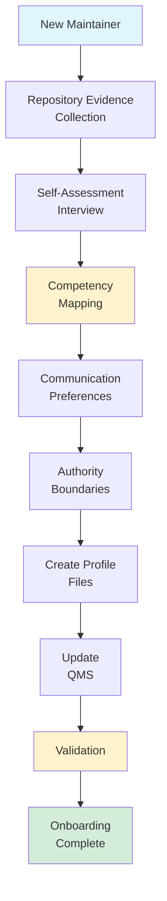

# Maintainer Onboarding Process

**Project:** GL.iNet Comet GPL Compliance Analysis
**Version:** 1.0
**Effective Date:** 2025-12-12
**Last Updated:** 2025-12-12
**Review Frequency:** Annually

---

## Purpose

This procedure guides the onboarding of new project maintainers to:
1. Assess technical competence and expertise areas
2. Capture communication preferences and collaboration style
3. Document authority boundaries and decision rights
4. Create user-specific AI agent reference documents
5. Integrate maintainer profile into Quality Management System

**Outcome:** Maintainer is ready for effective collaboration with AI agents and has a documented competency profile integrated into the QMS.

---

## Scope

**Applies to:**
- New project maintainers (direct commit access, issue triage, PR approval)
- Existing maintainers creating their first profile

**Does NOT apply to:**
- External contributors (use CONTRIBUTING.md instead)
- One-time code contributors
- Issue reporters or discussants

---

## Process Flow



---

## Inputs

- **New maintainer information** (GitHub username, email, background)
- **External evidence sources** (other GitHub repositories, resume/CV)
- **USER-PROFILE-SCHEMA.md** (schema documentation)
- **Self-assessment responses** (interview answers)

---

## Step-by-Step Procedure

### Step 1: Repository Evidence Collection

**Purpose:** Analyze external contributions to assess demonstrated competency.

**IMPORTANT:** Do NOT use this repository for evidence (AI-assisted work). Use external sources only.

#### Actions

1. **Collect GitHub Portfolio**
   - Visit `https://github.com/<username>?tab=repositories`
   - Identify repositories authored WITHOUT AI assistance
   - Analyze:
     - Languages used (Python, Bash, Go, Rust, JavaScript, etc.)
     - Project complexity (lines of code, architecture, features)
     - Code quality (formatting, testing, documentation)
     - Contribution patterns (commits, PRs, issues)
     - Domain areas (web dev, systems programming, security, etc.)

2. **Collect Resume/CV**
   - Request resume/CV from maintainer (or access public URL like stevenhay.com/cv)
   - Extract:
     - Professional experience (roles, companies, duration)
     - Education and certifications
     - Technical skills (languages, tools, methodologies)
     - Project leadership experience
     - Domain expertise (reverse engineering, GPL law, firmware, etc.)

3. **Document Evidence**
   - Create evidence document listing:
     - GitHub repositories analyzed (name, URL, language, complexity)
     - Key contributions (features, commits, projects)
     - Professional experience highlights
     - Education/certifications
     - Domain areas demonstrated

#### Output

Evidence document with:
- GitHub portfolio analysis (repositories, languages, complexity)
- Resume/CV highlights (experience, education, skills)
- Initial competency indicators (domains where evidence exists)

**Template:**
```markdown
# Evidence Collection: <username>

## GitHub Portfolio (github.com/<username>)

**Repositories Analyzed:**
1. [repo-name](URL) - Language: Python, Complexity: ~5K LOC, Features: CLI tool, testing framework
2. [repo-name](URL) - Language: Bash, Complexity: ~500 LOC, Features: Automation scripts
3...

**Languages:** Python (advanced), Bash (intermediate), Go (novice)
**Project Types:** CLI tools, automation, web scraping
**Code Quality:** PEP 8 compliant, test coverage >80%, documented

## Resume/CV (stevenhay.com/cv or provided)

**Professional Experience:**
- Role: Senior Engineer at Company (2020-2024)
- Role: Developer at Company (2018-2020)

**Education:**
- BS Computer Science, University (2018)

**Certifications:**
- Certified Ethical Hacker (CEH)
- GIAC Reverse Engineering Malware (GREM)

**Technical Skills:**
- Reverse Engineering, Firmware Analysis, Python, Bash, GPL Compliance

## Initial Competency Indicators

- **Reverse Engineering**: Advanced (GREM cert, firmware projects)
- **Python**: Advanced (5K+ LOC projects, testing, PEP 8)
- **Bash**: Intermediate (automation scripts, shellcheck usage)
- **GPL Compliance**: Advanced (professional experience, research)
```

---

### Step 2: Self-Assessment Interview

**Purpose:** Capture self-declared expertise, background, and preferences.

#### Interview Questions

Conduct interview (written or verbal) covering these areas:

**1. Background**
- What's your technical background?
- What experience do you have with [relevant domains for this project: reverse engineering, GPL, firmware analysis, Python, Bash, quality management]?
- Any relevant certifications or training?
- What motivated you to contribute to this project?

**2. Expertise Self-Assessment**

For each competency domain, ask maintainer to self-rate:

**Technical Domains:**
- Reverse Engineering
- GPL Compliance Law
- Python Development
- Bash Scripting
- Git/Version Control
- Firmware Analysis Tools (binwalk, strings, dtc, etc.)
- Documentation Writing
- Testing and Quality Assurance

**Process Domains:**
- Quality Management (ISO 9001)
- Project Architecture
- AI Agent Orchestration
- Black Box Methodology
- Risk Management

**Rating Scale:**
- **Expert**: Deep domain knowledge, can teach others, designs frameworks
- **Advanced**: Strong working knowledge, handles complex tasks independently
- **Intermediate**: Working knowledge, handles routine tasks independently
- **Novice**: Learning, needs guidance and supervision
- **N/A**: Not applicable to my role

**3. Communication Style**
- Do you prefer Completed Staff Work (present solutions vs. problems)?
  - Strong preference (always solutions)
  - Moderate preference (solutions for complex issues)
  - Weak preference (okay to bring problems)
- What detail level do you prefer?
  - Planning: [High | Moderate | Low]
  - Implementation: [High | Moderate | Low]
  - Routine tasks: [High | Moderate | Low]
- When should AI agents ask you vs. proceed autonomously?
  - List examples of "always ask" decisions
  - List examples of "ask if uncertain" situations
  - List examples of "proceed autonomously" tasks

**4. Authority Preferences**
- What decisions do you want to make personally?
  - Examples: Policy changes, legal positions, methodology principles, external communication
- What decisions can AI agents make (with rationale)?
  - Examples: Implementation approaches, code refactoring, test strategies
- What should AI agents do autonomously without asking?
  - Examples: Code formatting, linting, running tests, following procedures

#### Output

Interview notes documenting:
- Background and experience summary
- Self-assessment ratings for each domain
- Communication preferences (CSW, detail level, escalation)
- Authority preferences (must decide, may decide, autonomous)

**Template:**
```markdown
# Self-Assessment Interview: <username>
**Date:** YYYY-MM-DD

## Background
- [Summary from interview]

## Expertise Self-Assessment

| Domain | Self-Rating | Notes |
|--------|------------|-------|
| Reverse Engineering | Advanced | 5 years experience, GREM certified |
| GPL Compliance | Advanced | Professional work, legal research |
| Python | Advanced | Primary language, 10+ years |
| ... | ... | ... |

## Communication Preferences

**Completed Staff Work:** Strong (always present solutions)
**Detail Level:**
- Planning: High (want to understand architecture and trade-offs)
- Implementation: Moderate (key decisions explained)
- Routine: Low (just execute and summarize)

**Escalation:**
- Always ask: Policy changes, legal positions, methodology principles
- Ask if uncertain: Major refactoring, new dependencies, architectural changes
- Proceed autonomously: Formatting, linting, tests, bug fixes within patterns

## Authority Preferences

**User Must Decide:**
- QMS policy changes
- GPL legal positions
- Methodology principles
- External communication

**Agent May Decide (with rationale):**
- Implementation approaches (within established patterns)
- Code refactoring (maintaining functionality)
- Test strategies (meeting coverage requirements)

**Agent Autonomous:**
- Code formatting, linting
- Running tests
- Following established procedures
```

---

### Step 3: Competency Mapping

**Purpose:** Reconcile evidence with self-assessment to determine verified competency levels.

#### Process

1. **Map Evidence to Domains**

For each competency domain, extract evidence from Step 1:

| Domain | Evidence from GitHub | Evidence from Resume | Self-Assessment |
|--------|---------------------|----------------------|-----------------|
| Python | 5K+ LOC projects, tests, PEP 8 | 10 years professional | Advanced |
| Reverse Engineering | Firmware analysis projects | GREM cert, 5 years experience | Advanced |
| Bash | 500 LOC automation scripts | Professional use | Intermediate |
| ... | ... | ... | ... |

2. **Compare and Reconcile**

For each domain:
- Where **evidence and self-assessment align** → Use the agreed level
- Where evidence is **stronger than self-assessment** → Discuss with maintainer, use higher level (evidence-based)
- Where self-assessment is **stronger than evidence** → Request additional evidence or use conservative level
- Where **no evidence exists** → Use self-assessment with "self-declared" note

3. **Assign Verified Levels**

Use standard definitions from USER-PROFILE-SCHEMA.md:

- **Expert**: Deep domain knowledge, can teach others, designs frameworks
  *Evidence*: Multiple complex projects, recognized contributions, framework/architecture design

- **Advanced**: Strong working knowledge, handles complex tasks independently
  *Evidence*: Complex projects, professional experience 3+ years, certifications

- **Intermediate**: Working knowledge, handles routine tasks independently
  *Evidence*: Routine projects, professional experience 1-3 years, basic usage

- **Novice**: Learning, needs guidance and supervision
  *Evidence*: Learning projects, no professional experience, requires guidance

4. **When to Defer vs. Challenge**

Based on verified levels, document collaboration guidance:

| Level | Agent Behavior | When to Defer | When to Challenge |
|-------|---------------|---------------|-------------------|
| **Expert** | Defer | Always - ask user, don't tell | Never - user is authority |
| **Advanced** | Collaborate | On architecture/design | Gently on implementation details |
| **Intermediate** | Lead with oversight | On preferences | When suggesting improvements |
| **Novice** | Agent leads | On user preferences only | When teaching/explaining |

#### Output

Competency mapping table with verified levels and evidence:

```markdown
# Competency Mapping: <username>

| Domain | Level | Evidence | Verification Method |
|--------|-------|----------|---------------------|
| Reverse Engineering | Advanced | GREM cert, firmware projects on GitHub, 5 years professional | Resume + GitHub portfolio |
| GPL Compliance | Advanced | Professional work, legal research, published analysis | Resume + self-assessment |
| Python | Advanced | 5K+ LOC projects, 10 years experience, PEP 8, tests | GitHub portfolio + resume |
| Bash | Intermediate | 500 LOC scripts, professional use, shellcheck | GitHub portfolio + resume |
| Project Architecture | Expert | Designed QMS for this project, methodology framework | Self-assessment (this project is AI-assisted, but architecture decisions were human) |
| ... | ... | ... | ... |

## Collaboration Guidance

**Defer (Expert domains):**
- Project Architecture: User designed QMS, methodology - defer on architectural decisions
- [Other Expert domains]

**Collaborate (Advanced domains):**
- Reverse Engineering: Discuss approaches, propose solutions, user decides
- GPL Compliance: Present legal research, user makes final call
- Python: Suggest patterns, user approves design

**Lead (Intermediate domains):**
- Bash: Recommend approaches with explanation, user can override
- [Other Intermediate domains]

**Own (Novice domains or not listed):**
- [Domains where agent should lead and teach]
```

---

### Step 4: Communication Preferences

**Purpose:** Document how AI agents should interact with this maintainer.

#### Capture

Based on Step 2 interview, document:

**1. Completed Staff Work Preference**

- **Strong**: Always present solutions, not problems. User expects finished recommendations ready for approval/disapproval.
  - Agent: "Analysis complete. Recommendation: [specific action with rationale]. Ready for approval."
  - NOT: "I found a problem, what should we do?"

- **Moderate**: Present solutions for complex issues, okay to bring problems for routine items.
  - Agent: Complex → solutions, Routine → problems okay

- **Weak**: Okay to bring problems and work through them together.
  - Agent: Can ask "what should we do?" for collaboration

**2. Detail Level Preferences**

For each work phase, document preference:

| Phase | High | Moderate | Low |
|-------|------|----------|-----|
| **Planning** | Full architecture, all trade-offs, risks, alternatives | Key decisions, major trade-offs | Summary only |
| **Implementation** | Every decision explained, step-by-step | Key decisions, approach rationale | Just the result |
| **Routine Tasks** | All steps documented | Summary of actions | "Done" |

**3. Escalation Guidance**

Document three categories:

**Always Ask User:**
- [List specific decision types requiring approval]
- Examples: QMS policy changes, GPL legal positions, methodology principles, external communication, breaking changes

**Ask if Uncertain:**
- [List gray area situations]
- Examples: Major refactoring, new dependencies, architectural changes, when authority is unclear

**Proceed Autonomously:**
- [List routine items agent handles]
- Examples: Code formatting, linting, running tests, bug fixes within patterns, following procedures

#### Output

Communication preferences section:

```markdown
# Communication Preferences: <username>

## Completed Staff Work
**Preference**: Strong

**Application**: User expects solutions, not problems. Always present:
- Analysis complete with findings
- Recommendation with specific action
- Rationale explaining the decision
- Ready for approval/disapproval (yes/no)

**Format**:
✅ Good: "Issue identified: [X]. Proposed solution: [Y]. Implementation ready for approval."
❌ Bad: "There's a problem with X. What should we do?"

## Detail Level

| Phase | Preference | Meaning |
|-------|-----------|---------|
| Planning | High | Full architecture, all trade-offs, risks, alternatives analyzed |
| Implementation | Moderate | Key decisions explained, approach rationale provided |
| Routine Tasks | Low | Just execute and summarize result |

## Escalation

**Always Ask:**
- QMS policy changes
- GPL legal positions
- Methodology principles
- External communication (forum posts, issues to vendors)
- Breaking changes to reproducibility or workflows
- Major architectural changes

**Ask if Uncertain:**
- Significant refactoring (>100 lines changed)
- New dependencies or tools
- Changes to QMS procedures
- Unclear authority level (better to ask than guess)

**Proceed Autonomously:**
- Code formatting (ruff format)
- Linting fixes (ruff check --fix)
- Running tests (pytest)
- Bug fixes following established patterns
- Following procedures P1-P4
- Documentation updates (non-substantive)
```

---

### Step 5: Authority Boundaries

**Purpose:** Define decision rights and approval requirements to prevent conflicts and ensure smooth collaboration.

#### Categories

Define three authority levels:

**1. Requires User Approval**

Decisions that MUST be approved by maintainer before execution:
- Policy changes (quality policy, methodology principles)
- Legal positions (GPL compliance interpretations, licensing decisions)
- External communication (forum posts, vendor communications, public statements)
- Major architectural changes (QMS structure, workflow redesign, tool changes)
- Breaking changes (affect reproducibility, existing workflows, or other maintainers)

**2. Delegated to AI Agents (with Rationale)**

Decisions agents may make but must provide rationale:
- Implementation approaches (within established patterns and procedures)
- Code refactoring (maintaining existing functionality and test coverage)
- Test strategies (meeting ≥60% coverage requirement)
- Issue/PR management (labeling, assignment, closing when criteria met)
- Minor documentation updates (clarifications, typos, examples)

**Agent must provide:**
- What decision was made
- Why this approach was chosen
- What alternatives were considered
- How it aligns with established patterns

**3. Agent Must Do Autonomously**

Tasks agent performs without asking:
- Code formatting (ruff format - enforced by CI)
- Linting fixes (ruff check --fix - enforced by CI)
- Running tests (pytest - part of workflow)
- Following established procedures (P1-P4 documented processes)
- Updating todos and tracking (maintaining work status)

**Agent should:**
- Execute immediately
- Summarize what was done
- Not ask permission for these routine tasks

#### Output

Authority boundaries section:

```markdown
# Authority Boundaries: <username>

## Requires User Approval

**Policy & Methodology:**
- QMS policy changes (QUALITY-POLICY.md)
- Methodology principle changes (black box methodology, reproducibility requirements)
- Quality objectives changes (coverage thresholds, test requirements)

**Legal & External:**
- GPL compliance interpretations
- Licensing decisions (project license, dependency licenses)
- External communication (forum posts, vendor issues, public statements)

**Architecture & Breaking Changes:**
- QMS structure changes (new procedures, procedure modifications)
- Workflow redesign (change to development process, CI/CD pipeline)
- Major tool changes (switching from pytest to another framework)
- Breaking changes (affect reproducibility, existing workflows, other maintainers)

## Delegated to AI Agents (with Rationale)

**Development Decisions:**
- Implementation approaches (must follow established patterns)
  - Rationale: "Using pattern X from script Y for consistency"
- Code refactoring (must maintain functionality and tests)
  - Rationale: "Refactoring to reduce duplication, all tests passing"
- Test strategies (must meet ≥60% coverage)
  - Rationale: "Added integration tests, coverage now 65%"

**Project Management:**
- Issue/PR management (labeling, assignment, closing)
  - Rationale: "Closing issue #X, all acceptance criteria met"
- Priority adjustments (within assigned work)
  - Rationale: "Prioritizing #Y over #Z due to blocking dependency"

**Documentation:**
- Minor documentation updates (clarifications, typos, examples)
  - Rationale: "Added example to clarify X, no substantive change"

**When Delegating:** Agent must explain decision and rationale. User can override.

## Agent Autonomous

**Code Quality (No Permission Needed):**
- Code formatting (ruff format)
- Linting fixes (ruff check --fix)
- Shellcheck compliance (for bash scripts)
- Running tests (pytest)

**Process Compliance (No Permission Needed):**
- Following procedures P1-P4
- Updating todo list and work status
- Maintaining evidence of work (commit messages, issue updates)
- Running pre-push hooks

**Routine Operations (No Permission Needed):**
- Git operations (add, commit, status, diff)
- File operations (read, write for assigned work)
- Tool operations (binwalk, strings, etc. for analysis)

**Agent should:** Execute immediately, summarize what was done, don't ask.
```

---

### Step 6: Create Profile Files

**Purpose:** Generate both AI agent reference and QMS competency profiles.

#### Actions

Create two profile files using templates from USER-PROFILE-SCHEMA.md:

**1. Create `.claude/agents/<username>.md` (Agent Reference)**

Location: `.claude/agents/<username>.md`

Template structure:
```markdown
---
name: <username>-context
description: Context about user <Full Name> (<username>) for AI agent collaboration. Reference only - not spawnable.
type: user-profile
user: <username>
last_updated: YYYY-MM-DD
---

# <Full Name> (<username>) - User Profile for AI Collaboration

**Purpose:** This document provides context for AI agents working with <username>.

**IMPORTANT:** This is a reference document, not a spawnable agent.

## Technical Expertise

### Expert Level (Defer to User)
[From Step 3: List Expert domains with evidence]

**When to defer:**
[Specific scenarios]

### Advanced Level (Collaborate Actively)
[From Step 3: List Advanced domains with evidence]

**When to collaborate:**
[Specific scenarios]

### Intermediate Level (Agent-Led with Oversight)
[From Step 3: List Intermediate domains with evidence]

**When to challenge (gently):**
[Specific scenarios]

### Novice Level (Agent Should Lead)
[Areas not listed above]

## Communication Preferences

[From Step 4: CSW, detail level, escalation]

## Authority Boundaries

[From Step 5: Must decide, may decide, autonomous]

## Evidence Base (External Sources)

**Evidence Sources**: [GitHub portfolio, resume/CV]

**Verified Competencies**: See `docs/quality/maintainers/<username>.md` for detailed evidence

## Using This Profile

[Guidance for AI agents on how to apply this profile]

---

**Last Updated**: YYYY-MM-DD
**Review Frequency**: Quarterly (during Management Review)
**Next Review**: YYYY-MM-DD OR XXX AI work-hours
```

Fill in all sections from Steps 1-5.

**2. Create `docs/quality/maintainers/<username>.md` (QMS Profile)**

Location: `docs/quality/maintainers/<username>.md`

Template structure:
```markdown
# Maintainer Competency Profile: <Full Name> (<username>)

**Role**: <Project role>
**Onboarding Date**: YYYY-MM-DD
**Last Reviewed**: YYYY-MM-DD
**Next Review**: YYYY-MM-DD (Annual)

---

## Competency Assessment

[From Step 3: Competency table with evidence]

---

## Evidence of Competence

### External Portfolio Analysis
[From Step 1: GitHub analysis]

### Professional Experience
[From Step 1: Resume highlights]

### Self-Declared Competencies
[From Step 2: Interview summary]

---

## Competency Gaps and Development Plan

**Identified Gaps**: [List]
**Development Actions**: [List]

---

## Communication and Collaboration Preferences

[From Step 4: Same as agent reference]

---

## Authority and Decision Rights

[From Step 5: Same as agent reference]

---

## Review History

| Date | Reviewer | Changes | Reason |
|------|----------|---------|--------|
| YYYY-MM-DD | Self (<username>) | Initial profile created | Onboarding |

---

## Integration with QMS

**Related Documents**:
- `.claude/agents/<username>.md` - AI agent reference version
- `COMPETENCY-MATRIX.md` - Overall competency framework
- `MANAGEMENT-REVIEW-TEMPLATE.md` - Quarterly review process

**Review Triggers**:
- **Scheduled**: Annual (YYYY-MM-DD)
- **Ad-hoc**: Competency gaps identified, role changes, QMS updates

---

**Approved By**: <Approver>
**Date**: YYYY-MM-DD
**Next Review**: YYYY-MM-DD (Annual)
```

Fill in all sections from Steps 1-5.

#### Quality Check

Before proceeding, verify:
- [ ] Both files created (`.claude/agents/<username>.md` AND `docs/quality/maintainers/<username>.md`)
- [ ] Content consistent between files (expertise levels, communication, authority)
- [ ] Evidence documented (external sources only)
- [ ] Communication preferences clear and actionable
- [ ] Authority boundaries defined for all three levels
- [ ] Files follow schema from USER-PROFILE-SCHEMA.md

#### Output

Two profile files:
1. `.claude/agents/<username>.md` - AI agent reference
2. `docs/quality/maintainers/<username>.md` - QMS competency profile

---

### Step 7: Update QMS

**Purpose:** Integrate new maintainer into QMS documentation.

#### Actions

**1. Update COMPETENCY-MATRIX.md**

Location: `docs/quality/COMPETENCY-MATRIX.md`

Find the "Maintainer Profiles" section (or create if first maintainer).

Add new row to table:

```markdown
| Maintainer | Role | Agent Reference | QMS Profile | Status |
|------------|------|-----------------|-------------|--------|
| <username> | <Role> | [.claude/agents/<username>.md](../../.claude/agents/<username>.md) | [maintainers/<username>.md](maintainers/<username>.md) | Active |
```

**2. Verify MANAGEMENT-REVIEW-TEMPLATE.md**

Location: `docs/quality/MANAGEMENT-REVIEW-TEMPLATE.md`

Verify Section 6.1.1 exists (should have been added in Issue #69).

No changes needed - template already reviews all maintainer profiles.

**3. Create maintainers directory (if first maintainer)**

If `docs/quality/maintainers/` doesn't exist:
```bash
mkdir -p docs/quality/maintainers
```

**4. Commit Changes**

Commit all profile files and QMS updates together:

```bash
git add .claude/agents/<username>.md
git add docs/quality/maintainers/<username>.md
git add docs/quality/COMPETENCY-MATRIX.md
git commit -m "chore: Complete onboarding for <username>

**Onboarding Summary:**
- Created AI agent reference profile (.claude/agents/<username>.md)
- Created QMS competency profile (docs/quality/maintainers/<username>.md)
- Updated COMPETENCY-MATRIX.md with maintainer profile link
- Evidence from: [list sources - GitHub repos, resume, interview]

**Competency Highlights:**
- <Domain>: <Level> (evidence: <source>)
- <Domain>: <Level> (evidence: <source>)
- [List 3-5 key competencies]

**Communication:** <CSW preference>, <detail level summary>
**Authority:** <Summary of must decide / may decide / autonomous>

Completes onboarding process defined in docs/quality/ONBOARDING-PROCESS.md

🤖 Generated with [Claude Code](https://claude.com/claude-code)

Co-Authored-By: Claude Sonnet 4.5 <noreply@anthropic.com>"
```

#### Output

- Updated `COMPETENCY-MATRIX.md` (maintainer added to table)
- All files committed to version control
- Git commit with comprehensive onboarding summary

---

### Step 8: Validation

**Purpose:** Verify onboarding completeness and AI agent usage.

#### Validation Checklist

Complete this checklist before marking onboarding complete:

**Evidence Collection:**
- [ ] External GitHub repositories analyzed (NOT this AI-assisted repo)
- [ ] Resume/CV reviewed and highlights documented
- [ ] Evidence document created with all sources

**Self-Assessment:**
- [ ] Interview conducted (all questions answered)
- [ ] Expertise self-ratings collected for all relevant domains
- [ ] Communication preferences documented
- [ ] Authority preferences captured

**Competency Mapping:**
- [ ] Evidence and self-assessment reconciled
- [ ] Verified competency levels assigned with justification
- [ ] Collaboration guidance documented (defer/collaborate/lead/own)

**Profiles Created:**
- [ ] `.claude/agents/<username>.md` created and complete
- [ ] `docs/quality/maintainers/<username>.md` created and complete
- [ ] Both files consistent with each other
- [ ] Both files follow USER-PROFILE-SCHEMA.md structure

**QMS Integration:**
- [ ] COMPETENCY-MATRIX.md updated (maintainer added to table)
- [ ] Files committed to version control
- [ ] Commit message comprehensive and follows format

**AI Agent Usage Test:**
- [ ] In new session, agent reads `.claude/agents/<username>.md`
- [ ] Agent understands expertise levels correctly
- [ ] Agent applies communication preferences (CSW, detail, escalation)
- [ ] Agent respects authority boundaries
- [ ] Test with sample scenarios:
  - Expert domain decision → Agent defers to user ✓
  - Advanced domain decision → Agent collaborates ✓
  - Routine task → Agent proceeds autonomously ✓

#### Testing AI Agent Usage

**Test Scenario 1: Expert Domain (Should Defer)**
```
User: "I'm thinking about changing the QMS structure."
Expected Agent Response: "This is an Expert domain (Project Architecture).
What changes are you considering? I can help implement once you decide the approach."
NOT: "I recommend we change X to Y."
```

**Test Scenario 2: Advanced Domain (Should Collaborate)**
```
User: "We need to add a new analysis script."
Expected Agent Response: "For the new analysis script, I recommend approach A because [rationale].
Alternative approaches B and C are also viable. Which would you prefer?"
NOT: "I'll implement approach A." (without discussing)
```

**Test Scenario 3: Routine Task (Should Proceed)**
```
User: "Fix the linting errors."
Expected Agent Response: [Runs ruff check --fix, commits]
"Fixed 12 linting errors with ruff. All checks passing."
NOT: "Should I fix the linting errors? Which ones?"
```

#### Output

Validation complete checklist with all items checked.

---

### Step 9: Onboarding Complete

**Purpose:** Confirm onboarding completion and next steps.

#### Outcomes

Upon successful validation:

✅ **Maintainer Profile Integrated**
- Two profile files created and committed
- COMPETENCY-MATRIX.md updated
- AI agents have user-specific context for collaboration

✅ **Authority and Communication Clear**
- Escalation paths documented
- Decision rights defined
- Collaboration style established

✅ **Evidence-Based Competency Assessment**
- Expertise levels verified from external sources
- Development plan created for any gaps
- Review schedule established

#### Next Steps

**For Maintainer:**
- Review both profile files (`.claude/agents/<username>.md` and `docs/quality/maintainers/<username>.md`)
- Confirm all information accurate
- Test collaboration with AI agents
- Provide feedback on onboarding process

**For AI Agents:**
- Read `.claude/agents/<username>.md` in each session for context
- Apply expertise levels (defer/collaborate/lead/own)
- Follow communication preferences (CSW, detail, escalation)
- Respect authority boundaries (must/may/autonomous)

**For QMS:**
- First quarterly review: 3 months OR 455 AI work-hours (whichever comes first)
- First annual review: 1 year from onboarding date
- Ad-hoc updates: As competencies evolve or gaps identified

---

## Outputs

This procedure produces:

1. **`.claude/agents/<username>.md`** - AI agent reference document
   - YAML frontmatter with metadata
   - Technical expertise (4 levels)
   - Communication preferences
   - Authority boundaries
   - Evidence base summary

2. **`docs/quality/maintainers/<username>.md`** - QMS competency profile
   - Competency assessment table
   - Evidence of competence (external sources)
   - Self-declared competencies
   - Competency gaps and development plan
   - Communication and authority (same as agent reference)
   - Review history

3. **Updated COMPETENCY-MATRIX.md** - Links to new profile

4. **Evidence Documentation** - GitHub portfolio analysis, resume highlights, interview notes

---

## Quality Controls

**Evidence-Based:**
- All competency levels tied to verifiable external evidence or explicit self-declaration
- No assumptions made without evidence
- Evidence sources documented (GitHub URLs, resume, interview transcript)

**Dual Profiles:**
- Agent reference and QMS profile created together
- Content synchronized (verified in validation step)
- Both committed in single commit

**Review Integration:**
- Quarterly: Management Review Section 6.1.1 checks profile accuracy
- Annual: Competency Matrix review reassesses all domains
- Ad-hoc: Updates when competencies change or gaps identified

**Version Control:**
- All profiles tracked in Git
- Change history preserved
- Commit messages explain rationale for updates

---

## Records

**Retained Records:**
- Git commit history (profile creation and updates) - Permanent
- Evidence documents (GitHub analysis, resume, interview notes) - 3 years
- Management review records (quarterly profile checks) - 3 years per ISO 9001
- Competency assessment updates - Permanent (in profile files)

**Record Location:**
- Profiles: `.claude/agents/<username>.md` and `docs/quality/maintainers/<username>.md` (in repository)
- Evidence: `docs/quality/maintainers/<username>-evidence.md` (optional, if detailed evidence stored)
- Management reviews: `docs/quality/management-reviews/YYYY-MM-DD.md` (when implemented)

---

## Risks Addressed

This procedure mitigates:

**R7: Resource/Time Constraints**
- Competency assessment ensures appropriate task delegation
- Authority boundaries prevent over-reliance on user for routine decisions
- AI agent context reduces communication overhead

**Collaboration Risks:**
- Clear authority boundaries prevent conflicts over decision rights
- Communication preferences reduce misunderstandings
- Expertise-weighted collaboration improves decision quality

**Quality Risks:**
- Evidence-based assessment ensures qualified maintainers
- Competency gaps identified and development planned
- Regular reviews (quarterly/annual) maintain accuracy

---

## Related Documents

- [USER-PROFILE-SCHEMA.md](USER-PROFILE-SCHEMA.md) - Profile structure and templates
- [COMPETENCY-MATRIX.md](COMPETENCY-MATRIX.md) - Overall competency framework
- [MANAGEMENT-REVIEW-TEMPLATE.md](MANAGEMENT-REVIEW-TEMPLATE.md) - Section 6.1.1 quarterly review
- [PROCEDURES.md](PROCEDURES.md) - Other QMS procedures (P1-P4)
- [CONTRIBUTING.md](../../CONTRIBUTING.md) - External contributor path (not maintainers)

---

## Revision History

| Version | Date | Changes | Author |
|---------|------|---------|--------|
| 1.0 | 2025-12-12 | Initial procedure created | AI Agent (Claude Sonnet 4.5) |

---

**Approved By:** Project Lead
**Date:** 2025-12-12
**Next Review:** 2026-12-12 (Annual)
