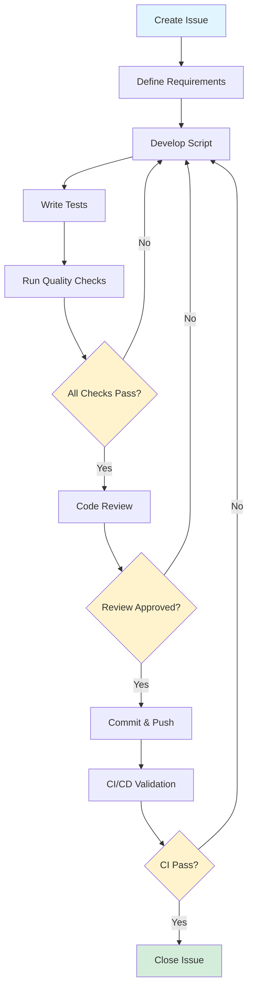
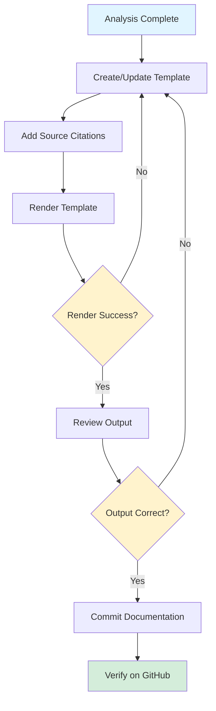
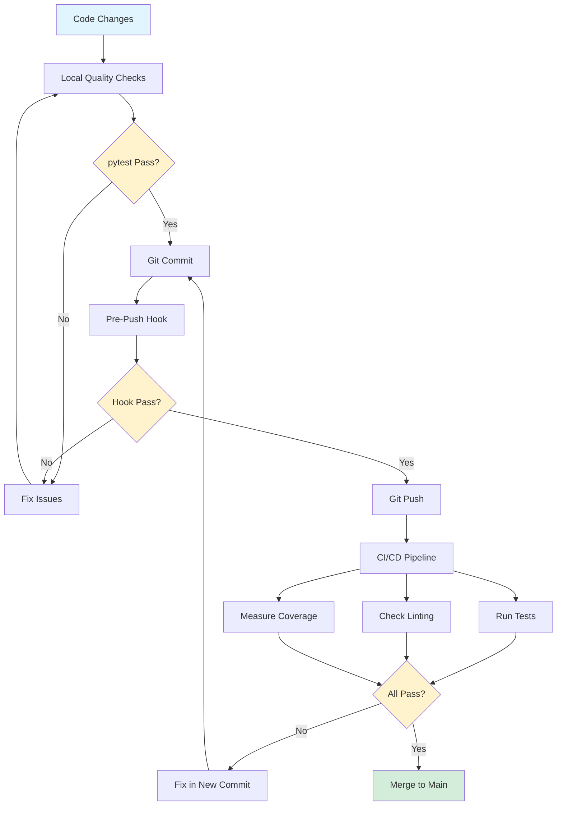
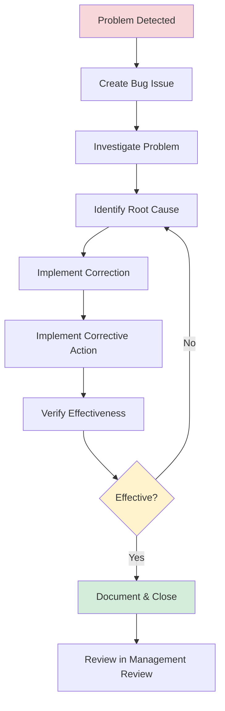
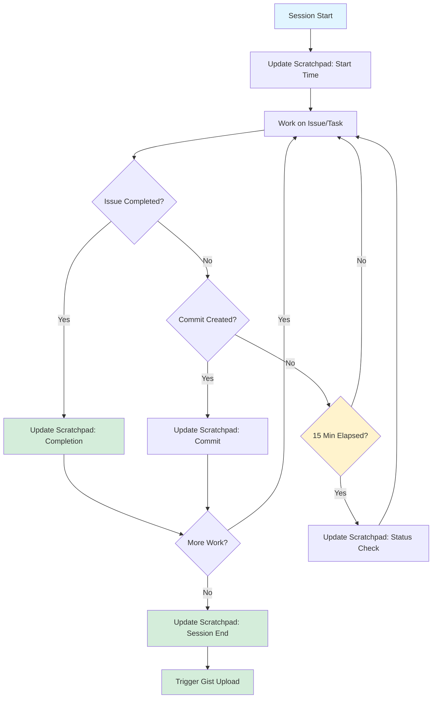
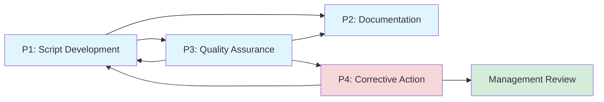

# Core Quality Procedures

**Project:** GL.iNet Comet GPL Compliance Analysis
**Version:** 1.0
**Effective Date:** 2025-12-12
**Last Updated:** 2025-12-12
**Review Frequency:** Annually or when processes change

---

## Purpose

This document defines the core procedures for the GL.iNet Comet GPL Compliance Analysis project, in accordance with ISO 9001:2015 Clause 8.1. These procedures ensure consistent execution of key processes and serve as the operational implementation of our Quality Policy.

**Scope:** This document covers the three essential procedures for project operations:
1. Analysis Script Development
2. Documentation Generation
3. Quality Assurance

These procedures integrate with our existing tools (GitHub Issues, CI/CD, pytest) and enforce our black box methodology principles.

---

## Procedure 1: Analysis Script Development

### 1.1 Purpose

Develop and validate analysis scripts that extract GPL-relevant information from firmware using black box reverse engineering methodology.

### 1.2 Scope

Applies to all Python and Bash scripts in `scripts/` that analyze firmware components.

### 1.3 Process Flow



### 1.4 Inputs

- **Analysis objective** (what to extract from firmware)
- **Firmware file** (GL.iNet Comet firmware image)
- **Analysis tools** (binwalk, strings, dtc, etc. from nix environment)
- **Black box methodology** (CLAUDE.md principles)

### 1.5 Step-by-Step Procedure

#### Step 1: Create Issue (Mandatory)

**Action:** Create GitHub issue using "Analysis Task" template

**Template:** `.github/ISSUE_TEMPLATE/analysis-task.yml`

**Required Fields:**
- Analysis objective (what GPL component to identify)
- Expected output format (TOML with source metadata)
- Success criteria (acceptance checklist)
- Risks to consider

**Quality Gate:** Issue must be approved before work begins

---

#### Step 2: Define Requirements

**Action:** In the issue, specify:
- Input: Firmware file path and expected format
- Output: TOML structure with `_source` and `_method` fields
- Tools: Which analysis tools will be used (binwalk, strings, etc.)
- Acceptance criteria: Specific test cases to validate

**Black Box Requirement:** All findings must be derivable from script output, no manual observations

---

#### Step 3: Develop Script

**Action:** Write Python or Bash script in `scripts/` directory

**Standards:**
- **Python:** PEP 8, type hints for public APIs
- **Bash:** Quote variables, use shellcheck
- **Output:** TOML format with source metadata
- **Documentation:** Docstrings and usage examples

**Black Box Principles:**
```python
# Good: Traceable finding
result = {
    "kernel_version": "5.10.110",
    "kernel_version_source": "kernel",
    "kernel_version_method": "strings kernel.img | grep 'Linux version'"
}

# Bad: Untraceable finding
result = {
    "kernel_version": "5.10.110"  # Where did this come from?
}
```

**Code Organization:**
- Use shared libraries in `scripts/lib/` to avoid duplication
- Extract reusable functions to modules (finders, extraction, firmware)
- Follow existing patterns in similar scripts

---

#### Step 4: Write Tests

**Action:** Create test file in `tests/test_<script_name>.py`

**Test Framework:** pytest with coverage measurement

**Required Test Types:**
1. **Unit tests:** Test individual functions with mock data
2. **Integration tests:** Test full script execution
3. **Edge cases:** Test error handling and boundary conditions
4. **Source metadata:** Verify `_source` and `_method` fields present

**Coverage Target:** ≥60% (enforced by CI)

**Example:**
```python
def test_analyze_kernel_output_format():
    """Test kernel analysis outputs required source metadata."""
    result = analyze_kernel(test_firmware)
    assert "kernel_version" in result
    assert "kernel_version_source" in result
    assert "kernel_version_method" in result
```

---

#### Step 5: Run Quality Checks

**Action:** Execute local quality validation before commit

**Command:**
```bash
pytest
```

**Checks Performed:**
- All unit tests pass (619+ tests)
- Code coverage ≥60%
- Ruff linting (zero errors)
- Ruff formatting (consistent style)
- Shellcheck validation (for bash scripts)

**Quality Gate:** All checks must pass before proceeding

**Quick Fixes:**
```bash
# Auto-fix linting issues
ruff check --fix scripts/ tests/

# Auto-format code
ruff format scripts/ tests/
```

---

#### Step 6: Code Review (Conditional)

**Trigger:** Significant code changes (>50 lines, complex logic, or architectural changes)

**Reviewer:** Opus code-reviewer agent (`.claude/agents/code-reviewer`)

**Review Criteria:**
- Correctness (does it work as intended?)
- Security (any vulnerabilities?)
- Maintainability (is it readable and well-structured?)
- Black box compliance (all findings traceable?)
- Test coverage (adequate tests for new code?)

**Action:** Address review feedback and re-run quality checks

---

#### Step 7: Commit & Push

**Action:** Commit changes with conventional commit message

**Commit Format:**
```bash
git commit -m "feat: Add analysis script for <component>

- Extracts <specific information>
- Outputs TOML with source metadata
- Includes <N> tests with <X>% coverage

Closes #<issue-number>

🤖 Generated with [Claude Code](https://claude.com/claude-code)" \
-m "Co-Authored-By: Claude Sonnet 4.5 <noreply@anthropic.com>"
```

**Pre-Push Hook:** Automatically runs pytest before allowing push

**Quality Gate:** Pre-push hook must pass (prevents broken code from reaching repository)

---

#### Step 8: CI/CD Validation

**Action:** GitHub Actions automatically runs on push

**CI Pipeline:** `.github/workflows/main.yml`

**Checks:**
- pytest on multiple Python versions
- Code quality validation
- Coverage reporting
- Shellcheck on bash scripts

**Expected:** ✅ All checks pass

**If Failed:** Fix issues and push again (return to Step 5)

---

#### Step 9: Close Issue

**Action:** Close GitHub issue with summary

**Summary Includes:**
- Script location (`scripts/<name>.py`)
- Output location (`results/<name>.toml`)
- Test coverage achieved
- Confirmation all acceptance criteria met

**Quality Record:** Closed issue serves as evidence of completed work

### 1.6 Outputs

- **Analysis script** in `scripts/` directory
- **Test suite** in `tests/` directory
- **Analysis results** in `results/` directory (TOML format)
- **Closed GitHub issue** documenting completion

### 1.7 Quality Controls

- **Pre-work:** Issue template enforces requirements definition
- **During work:** pytest enforces code quality standards
- **Pre-commit:** Local quality checks prevent broken code
- **Pre-push:** Automated hook runs full test suite
- **Post-push:** CI/CD validates on multiple environments

### 1.8 Records

- GitHub issue (requirements, acceptance criteria, closure notes)
- Git commit history (who, what, when, why)
- CI/CD logs (test results, coverage reports)
- Test files (executable validation of behavior)

### 1.9 Risks Addressed

- **R2: False Positive in Analysis** - Mitigated by comprehensive testing
- **R6: Insufficient Documentation** - Mitigated by source metadata requirement
- **Code quality risks** - Mitigated by automated quality gates

### 1.10 Related Documents

- [Black Box Methodology](../../CLAUDE.md#reverse-engineering-methodology)
- [Issue Template: Analysis Task](../../.github/ISSUE_TEMPLATE/analysis-task.yml)
- [Quality Objectives](QUALITY-OBJECTIVES.md) - Objective 3 (Test Coverage)

---

## Procedure 2: Documentation Generation

### 2.1 Purpose

Generate reproducible documentation from analysis results using Jinja templates that automatically cite sources.

### 2.2 Scope

Applies to all wiki pages and documentation generated from analysis results.

### 2.3 Process Flow



### 2.4 Inputs

- **Analysis results** (`results/*.toml` files with source metadata)
- **Jinja templates** (`templates/wiki/*.md.j2`)
- **Template renderer** (`scripts/render_template.py`)

### 2.5 Step-by-Step Procedure

#### Step 1: Verify Analysis Complete

**Action:** Confirm analysis script has generated results file

**Validation:**
```bash
# Check results file exists
ls -lh results/<component>.toml

# Verify source metadata present
grep "_source" results/<component>.toml
grep "_method" results/<component>.toml
```

**Quality Gate:** Results file must contain source metadata for all findings

---

#### Step 2: Create or Update Template

**Action:** Create Jinja template in `templates/wiki/`

**Template Structure:**
```jinja
# Component Name

## Overview

{{ component.description }}

## Key Findings

Version: {{ component.version | src }}
Location: {{ component.location | src }}

## Analysis Details

{{ component.details }}

{{ render_footnotes() }}
```

**Requirements:**
- Use `| src` filter for all factual claims
- Use `analyze()` function to load results
- Include `render_footnotes()` at end
- Follow existing template patterns

---

#### Step 3: Add Source Citations

**Action:** Ensure all findings use the `| src` filter

**Automatic Citation:** The `| src` filter automatically:
1. Looks up `_source` and `_method` fields
2. Generates footnote reference
3. Adds footnote to bibliography

**Example:**
```jinja

Kernel version {{ kernel.version | src }} was identified.

{# Renders as: #}
Kernel version 5.10.110[^1] was identified.

[^1]: [scripts/analyze_kernel.py](../scripts/analyze_kernel.py) - `strings kernel.img | grep 'Linux version'`
```

---

#### Step 4: Render Template

**Action:** Execute template renderer

**Command:**
```bash
./scripts/render_template.py templates/wiki/<template>.md.j2 wiki/<output>.md
```

**Expected:** Markdown file generated with inline citations and footnotes

---

#### Step 5: Review Output

**Action:** Verify rendered documentation

**Checklist:**
- [ ] All claims have footnote citations
- [ ] Footnotes reference correct scripts and methods
- [ ] No hard-coded findings (everything from analysis results)
- [ ] Markdown renders correctly
- [ ] Links work correctly

**Tool:** Use markdown preview or GitHub preview

---

#### Step 6: Commit Documentation

**Action:** Commit rendered documentation

**Files to Commit:**
- Template file (`templates/wiki/<name>.md.j2`)
- Rendered output (`wiki/<name>.md`)
- Analysis results (`results/<name>.toml`) if updated

**Commit Format:**
```bash
git commit -m "docs: Generate wiki page for <component>

- Auto-generated from results/<component>.toml
- All findings cited with source metadata
- <N> footnotes linking to analysis scripts

Related: #<issue-number>"
```

---

#### Step 7: Verify on GitHub

**Action:** View rendered page on GitHub to ensure correct display

**Validation:**
- Markdown renders properly
- Footnotes display correctly
- Links to scripts work
- Images/diagrams render (if applicable)

### 2.6 Outputs

- **Jinja template** (`templates/wiki/`)
- **Rendered markdown** (`wiki/` or `docs/`)
- **Automatic citations** (footnotes linking to scripts)

### 2.7 Quality Controls

- **Source metadata required** - Template won't render properly without `_source`/`_method` fields
- **Automatic citation** - `| src` filter prevents uncited claims
- **Version control** - Templates and outputs tracked in Git
- **Visual review** - GitHub rendering validates markdown correctness

### 2.8 Records

- Git commit history (template + rendered output)
- Analysis results files (source data)
- GitHub wiki/docs pages (published documentation)

### 2.9 Risks Addressed

- **R1: Legal/GPL Compliance Risk** - Mitigated by complete traceability
- **R2: False Positive in Analysis** - Mitigated by linking claims to methods
- **R6: Insufficient Documentation** - Mitigated by automatic citation system

### 2.10 Related Documents

- [Documentation System](../../CLAUDE.md#documentation-system)
- [Design: Jinja Documentation](../design-jinja-documentation.md)
- [Quality Policy](QUALITY-POLICY.md) - Commitment 2 (Reproducibility)

---

## Procedure 3: Quality Assurance

### 3.1 Purpose

Ensure all code meets quality standards before integration through automated testing, linting, and continuous integration.

### 3.2 Scope

Applies to all code changes (scripts, tests, documentation, configuration).

### 3.3 Process Flow



### 3.4 Inputs

- **Code changes** (Python scripts, tests, bash scripts, documentation)
- **pytest configuration** (`pyproject.toml`)
- **Quality standards** (CLAUDE.md code quality section)

### 3.5 Step-by-Step Procedure

#### Step 1: Local Quality Checks

**Action:** Run full test suite with quality checks

**Command:**
```bash
pytest
```

**What This Runs:**
1. All unit tests (619+ tests)
2. Integration tests
3. Code formatting checks (ruff format)
4. Code linting checks (ruff check)
5. Shellcheck validation (bash scripts)
6. Coverage measurement (60% minimum)

**Output:**
```
============================= test session starts ==============================
...
============================= 619 passed in 3.23s ==============================

Coverage: 60%+
```

**Quality Gate:** All tests must pass, coverage ≥60%

---

#### Step 2: Address Quality Issues

**If Failures Occur:**

**Linting Errors:**
```bash
# See specific errors
pytest tests/test_code_quality.py -v

# Auto-fix linting issues
ruff check --fix scripts/ tests/
```

**Formatting Issues:**
```bash
# Auto-format code
ruff format scripts/ tests/
```

**Test Failures:**
```bash
# Run specific test file
pytest tests/test_<name>.py -v

# Run specific test
pytest tests/test_<name>.py::test_function_name -v
```

**Coverage Issues:**
- Add tests for uncovered code
- See [Coverage Improvement Plan](../COVERAGE-IMPROVEMENT-PLAN.md)

---

#### Step 3: Commit Changes

**Action:** Commit code when all local checks pass

**Standards:**
- Atomic commits (one logical change per commit)
- Conventional commit types (`feat:`, `fix:`, `docs:`, `refactor:`, `chore:`)
- Descriptive commit message

**Format:** See Procedure 1, Step 7

---

#### Step 4: Pre-Push Hook Execution

**Action:** Automatic execution when running `git push`

**Hook Location:** `.git/hooks/pre-push`

**What It Does:**
1. Runs `pytest` (all tests + quality checks)
2. Blocks push if any check fails
3. Shows clear error message

**Example Output:**
```
🔍 Running pre-push quality checks...

Running pytest (includes format/lint/quality checks)...
✅ All pre-push checks passed! Proceeding with push...
```

**Quality Gate:** Cannot push to remote if hook fails (prevents broken code in repository)

**Override:** Not recommended, but possible with `git push --no-verify` (only use for emergencies with project lead approval)

---

#### Step 5: CI/CD Pipeline

**Trigger:** Push to main or pull request creation

**Pipeline:** `.github/workflows/main.yml`

**Jobs:**
1. **Test Job:**
   - Sets up nix environment
   - Installs dependencies
   - Runs pytest with all checks
   - Generates coverage report

2. **Quality Job:**
   - Validates code formatting
   - Runs linting checks
   - Validates shellcheck

**Expected Duration:** ~2-5 minutes

**Notification:** GitHub shows status on commit/PR

---

#### Step 6: CI/CD Results Review

**Success (✅):**
- Green checkmark on GitHub
- All checks passed
- Code is ready for merge/use

**Failure (❌):**
- Red X on GitHub
- Check logs for specific errors
- Create fix commit and push again

**Viewing Logs:**
1. Click on red X in GitHub
2. Click "Details" on failed check
3. Review error messages
4. Fix locally and push again

---

#### Step 7: Continuous Monitoring

**Metrics Tracked:**
- Test pass rate (target: 100%)
- Code coverage (target: ≥60%)
- CI success rate (target: >95%)
- Build time (target: <5 minutes)

**Review Frequency:**
- Daily: Monitor CI results
- Quarterly: Review metrics in Management Review (see MANAGEMENT-REVIEW-TEMPLATE.md)

**Improvement Actions:**
- Add tests for uncovered code
- Refactor slow tests
- Update quality standards as needed

### 3.6 Outputs

- **Test results** (pass/fail status)
- **Coverage reports** (percentage + line-level detail)
- **Linting results** (errors/warnings)
- **CI/CD logs** (build artifacts)

### 3.7 Quality Controls

- **Automated gates** - pytest runs automatically
- **Pre-push hook** - Prevents broken pushes
- **CI/CD validation** - Independent verification
- **Coverage enforcement** - 60% minimum required

### 3.8 Records

- pytest output logs (local + CI)
- Coverage reports (HTML + terminal)
- CI/CD pipeline logs (GitHub Actions)
- Git commit history (shows when checks passed)

### 3.9 Risks Addressed

- **R2: False Positive in Analysis** - Mitigated by comprehensive testing
- **R3: Dependency Supply Chain Risk** - Mitigated by nix reproducibility
- **Code quality risks** - Mitigated by automated enforcement

### 3.10 Related Documents

- [Code Quality Standards](../../CLAUDE.md#code-quality)
- [Quality Objectives](QUALITY-OBJECTIVES.md) - Objectives 3 & 4
- [Pre-Push Hook](../../.git/hooks/pre-push)

---

## Procedure 4: Corrective Action Process

### 4.1 Purpose

Systematically address non-conformances, identify root causes, and implement corrective actions to prevent recurrence, in accordance with ISO 9001:2015 Clause 10.2.

### 4.2 Scope

Applies to:
- Bugs and defects in analysis scripts
- Test failures
- Quality gate failures
- Process non-conformances
- Adverse findings from management review or audits

### 4.3 Process Flow



### 4.4 Inputs

- **Problem identification** (test failure, bug report, quality issue)
- **Bug template** (`.github/ISSUE_TEMPLATE/bug.yml`)
- **Root cause analysis** (investigation findings)

### 4.5 Step-by-Step Procedure

#### Step 1: Problem Detection

**Trigger Points:**
- Automated: Test failures, CI failures, quality check failures
- Manual: User reports, code review findings, audit findings
- Proactive: Management review identifies potential issues

**Action:** Recognize that a non-conformance has occurred

**Examples:**
- Test suddenly fails after code change
- Analysis script produces incorrect output
- Quality check blocks commit/push
- CI pipeline fails after merge

---

#### Step 2: Create Bug Issue

**Action:** Create GitHub issue using "Bug Report" template

**Template:** `.github/ISSUE_TEMPLATE/bug.yml`

**Required Fields:**
- **Bug Category:** Analysis script, template rendering, caching, test failure, CI/CD, documentation
- **Bug Description:** Clear description of what's wrong
- **Reproduction Steps:** Minimal steps to reproduce
- **Expected Behavior:** What should happen
- **Actual Behavior:** What actually happens
- **Root Cause Analysis:** (filled in during investigation)
- **Environment:** OS, nix version, Python version

**Priority Assessment:**
- **High:** Blocks development, incorrect analysis results, data loss risk
- **Medium:** Workaround exists, non-critical functionality affected
- **Low:** Minor issue, cosmetic, or low-impact

**Quality Gate:** Issue must be created before work begins (ensures tracking)

---

#### Step 3: Investigate Problem

**Action:** Gather information to understand the problem

**Investigation Steps:**
1. **Reproduce:** Confirm bug is reproducible
2. **Isolate:** Identify which component/function is failing
3. **Review Code:** Examine relevant code sections
4. **Check History:** When did this start? What changed?
5. **Test Cases:** Are existing tests inadequate?

**Tools:**
```bash
# Git history
git log --oneline -- <file>
git blame <file>

# Test specific component
pytest tests/test_<component>.py -v

# Run with debugging
pytest tests/test_<component>.py -v --pdb
```

**Evidence Collection:**
- Error messages and stack traces
- Input data that causes failure
- Expected vs. actual output
- Related code changes (git diff)

---

#### Step 4: Identify Root Cause

**Action:** Determine underlying cause, not just symptoms

**Root Cause Analysis Questions:**
1. What was the immediate cause of the problem?
2. Why did this cause occur? (5 Whys technique)
3. Why wasn't this caught earlier?
4. What category does this fall into?

**Root Cause Categories:**
- **Logic error:** Incorrect algorithm or conditional
- **Incorrect assumption:** Assumptions about data or behavior
- **Missing validation:** Input not properly validated
- **Edge case:** Unexpected input or condition
- **Environment issue:** Tool version, dependency problem
- **Test gap:** Inadequate test coverage
- **Documentation gap:** Unclear requirements or spec

**Document in Issue:**
Update the "Root Cause Analysis" field in the bug template:

```markdown
## Root Cause Analysis

The script used `grep 'Linux version'` which matched a debug string
instead of the actual kernel version string. The test fixture didn't
include this edge case.

**Category:** Incorrect assumption about string uniqueness

**Why not caught earlier:** Test data too simple, didn't match real
firmware complexity
```

**Quality Gate:** Root cause must be identified before implementing fix

---

#### Step 5: Implement Correction

**Action:** Fix the immediate problem

**Correction vs. Corrective Action:**
- **Correction:** Fix the bug (immediate fix)
- **Corrective Action:** Prevent it from happening again (systemic fix)

**Implementation:**
1. Write fix for the specific bug
2. Verify fix resolves the problem
3. Run quality checks
4. Commit with descriptive message

**Example Correction:**
```python
# Before (bug)
kernel_version = grep_output.split('Linux version')[1].split()[0]

# After (correction)
# Use more specific pattern to avoid matching debug strings
pattern = r'Linux version (\d+\.\d+\.\d+)'
match = re.search(pattern, grep_output)
kernel_version = match.group(1) if match else None
```

---

#### Step 6: Implement Corrective Action

**Action:** Address systemic issues to prevent recurrence

**Corrective Actions by Root Cause:**

| Root Cause Category | Typical Corrective Actions |
|---------------------|---------------------------|
| Logic error | Add unit tests, code review |
| Incorrect assumption | Document assumptions, add validation tests |
| Missing validation | Add input validation, defensive programming |
| Edge case | Add edge case tests, improve test data |
| Environment issue | Pin versions in nix flake, document dependencies |
| Test gap | Increase coverage, add integration tests |
| Documentation gap | Update docs, add examples, clarify requirements |

**Examples:**
```python
# Corrective Action 1: Add regression test
def test_kernel_version_with_debug_strings():
    """Ensure we don't match debug strings."""
    firmware_with_debug = create_test_firmware(
        strings=["Debug: Linux version 0.0.0", "Linux version 5.10.110"]
    )
    result = analyze_kernel(firmware_with_debug)
    assert result["kernel_version"] == "5.10.110"  # Not 0.0.0

# Corrective Action 2: Add validation
def extract_kernel_version(grep_output: str) -> str | None:
    """Extract kernel version, handling edge cases.

    Args:
        grep_output: Output from grep command

    Returns:
        Kernel version string or None if not found

    Raises:
        ValueError: If output format is unexpected
    """
    # Implementation with better error handling
```

**Documentation Updates:**
- Update procedure if process gap identified
- Update CLAUDE.md if methodology issue
- Add comments to complex code sections

---

#### Step 7: Verify Effectiveness

**Action:** Confirm corrective action prevents recurrence

**Verification Methods:**
1. **Regression Test:** New test must fail before fix, pass after
2. **Integration Test:** Full workflow test with realistic data
3. **Coverage:** Verify coverage increased for affected code
4. **Code Review:** Have another agent/human review the fix

**Verification Checklist:**
- [ ] Original bug fixed (correction works)
- [ ] Regression test added (catches this specific bug)
- [ ] Root cause addressed (corrective action prevents category)
- [ ] All tests pass
- [ ] Coverage maintained or increased
- [ ] Documentation updated (if needed)

**Quality Gate:** Verification must confirm both correction and corrective action are effective

---

#### Step 8: Document & Close

**Action:** Document the resolution and close the issue

**Closure Comment Template:**
```markdown
## Resolution

**Root Cause:** [Brief summary]

**Correction:** [What was fixed]

**Corrective Action:** [What prevents recurrence]

**Verification:**
- [x] Regression test added: `tests/test_<component>.py::test_<specific_case>`
- [x] All tests passing
- [x] Coverage: <X>% (maintained/increased)
- [x] Code reviewed by: [Agent/Human]

**Files Changed:**
- `scripts/<script>.py` - Fixed logic error
- `tests/test_<script>.py` - Added regression test
- `docs/quality/PROCEDURES.md` - Updated procedure (if applicable)

**Commits:**
- Fix: <commit hash>
- Tests: <commit hash>

Closes #<issue-number>
```

**Update Issue:**
1. Complete root cause analysis field
2. Add resolution comment
3. Close issue with appropriate label
4. Link related commits

---

#### Step 9: Review in Management Review

**Action:** Aggregate corrective actions for quarterly review

**Management Review Integration:**
- Section 3.2: Process Conformity - Review non-conformances
- Section 9.2: Corrective Actions - Review effectiveness
- Section 9.3: Preventive Actions - Identify patterns

**Quarterly Analysis:**
- How many bugs this quarter?
- What are common root causes?
- Are corrective actions effective?
- What systemic improvements are needed?

**Continuous Improvement:**
- Trends in bug categories guide improvement efforts
- Repeated root causes indicate process gaps
- Corrective action effectiveness drives quality objectives

### 4.6 Outputs

- **Fixed bug** (correction implemented)
- **Regression test** (prevents recurrence)
- **Updated tests** (corrective action)
- **Documentation updates** (if needed)
- **Closed issue** (complete record)
- **Lessons learned** (for management review)

### 4.7 Quality Controls

- **Issue template** enforces structured problem reporting
- **Root cause analysis** required before fix
- **Regression test** required for closure
- **Verification checklist** ensures completeness
- **Management review** tracks effectiveness

### 4.8 Records

- GitHub issue with root cause analysis
- Git commits (correction + corrective action)
- Test files (regression tests)
- Management review records (quarterly analysis)

### 4.9 Metrics

**Tracked in Quality Objectives:**
- Bug count per quarter (Continuous Improvement objective)
- Time to resolution
- Recurrence rate (same bug reappears)
- Root cause categories (identify patterns)

**Review in Management Review:**
- Section 2.3: Corrective actions impact on objectives
- Section 3.2: Non-conformance patterns
- Section 9.2: Effectiveness analysis

### 4.10 Risks Addressed

- **R2: False Positive in Analysis** - Mitigated by regression testing
- **R6: Insufficient Documentation** - Mitigated by documentation updates
- **Quality risks** - Mitigated by systemic corrective actions

### 4.11 Related Documents

- [Bug Template](../../.github/ISSUE_TEMPLATE/bug.yml)
- [Quality Objectives](QUALITY-OBJECTIVES.md) - Objective 5 (Continuous Improvement)
- [Management Review Template](MANAGEMENT-REVIEW-TEMPLATE.md) - Sections 3.2, 9.2
- [CLAUDE.md](../../CLAUDE.md) - Quality standards

### 4.12 Distinction: Correction vs. Corrective Action vs. Preventive Action

**Correction:**
- **What:** Fix the immediate problem
- **When:** As soon as problem detected
- **Example:** Fix the bug in the code

**Corrective Action:**
- **What:** Eliminate the cause to prevent recurrence
- **When:** After root cause identified
- **Example:** Add regression test, improve validation, update procedure

**Preventive Action:**
- **What:** Eliminate potential causes before problems occur
- **When:** Proactively, during planning or review
- **Example:** Add edge case tests before bug occurs, improve documentation

**All three are important:**
```
Problem Occurs → Correction (fix it now)
              → Corrective Action (prevent THIS problem)
              → Preventive Action (prevent SIMILAR problems)
```

---

## Procedure 5: Session Management and Status Tracking

### 5.1 Purpose

Maintain accurate real-time work status for crash recovery, progress visibility, work-hour tracking, and QMS compliance. Ensures scratchpad file remains current during all active development sessions.

### 5.2 Scope

Applies to:
- All Claude Code development sessions
- AI agent work (primary)
- Human maintainer sessions (when using scratchpad)
- Multi-hour work sessions requiring crash recovery

### 5.3 Process Flow



### 5.4 Inputs

- **Session start time** (UTC timestamp)
- **Planned work** (issues from GitHub)
- **Completion events** (issue closed, commit created)
- **Session end time** (UTC timestamp)

### 5.5 Step-by-Step Procedure

#### Step 1: Session Start (MANDATORY)

**Action:** Update scratchpad at beginning of session

**File:** `/tmp/claude-glinet-comet-reversing/scratchpad.md`

**Update Required Fields:**
```markdown
**Last Updated:** 2025-12-12 HH:MM UTC
**Current Work:** [Description of planned work]
```

**Quality Gate:** Session cannot proceed without scratchpad initialization

**Example:**
```markdown
**Last Updated:** 2025-12-12 14:30 UTC
**Current Work:** Starting work on Issue #60 - Add status link to README
```

---

#### Step 2: After Each Issue Completion (MANDATORY)

**Trigger:** Issue is closed via `gh issue close`

**Action:** Update scratchpad immediately

**Update Sections:**
1. **Recent Completions** - Add closed issue with link
2. **Current Work** - Update to next planned work or "Session cleanup"
3. **Last Updated** - Current UTC timestamp

**Maximum Delay:** 5 minutes after issue closure

**Example:**
```markdown
### Issues Closed
- ✅ [#60](https://github.com/stvhay/glinet-comet-reverse-gpl/issues/60) - Add status link to README (CLOSED)

**Last Updated:** 2025-12-12 15:45 UTC
**Current Work:** Issue #63 - Simplify settings.local.json permissions
```

**Quality Gate:** Scratchpad staleness must not exceed 15 minutes during active work

---

#### Step 2.5: During Transitional Work (MANDATORY)

**Trigger:** Work continues after issue completion but before session end

**Examples of Transitional Work:**
- Preparing session summaries
- Answering user questions about completed work
- Planning next issues
- Documentation cleanup
- RCA preparation
- Code review of completed work
- Waiting for user approval/decisions
- Implementing corrective actions (like this one!)

**Action:** Apply periodic updates (every 15 minutes - same as Step 4)

**Quality Gate:** Transitional work is "active work" and requires same update frequency as issue work

**Update Format:**
```markdown
**Last Updated:** [UTC timestamp]
**Current Work:** [Describe transitional work]
```

**Examples:**
- "Preparing summary of Issue #31 for user"
- "Awaiting user review of proposed changes"
- "Implementing CA #1-5 from NCR-2025-12-13-001"
- "Conducting RCA of P5 violation"

**Rationale:** Transitional work phases can extend for significant time. Without updates during these phases, work-hour tracking fails and crash recovery is impossible.

**Cache System Usage:**
```python
from scripts.lib.scratchpad_cache import update
update("Current transitional work description")
# Fast, <100ms, auto-regenerates scratchpad.md
```

**Implementation Note:** This step was added via NCR-2025-12-13-001 to address gap identified in RCA of scratchpad staleness violations.

---

#### Step 3: After Each Commit (AUTOMATED)

**Trigger:** Commit created and pushed

**Action:** Update "Recent Commits" section

**Update Format:**
```markdown
## Recent Commits (Last 7)

- <hash> - <commit message>
- <hash> - <commit message>
...
```

**Automation Opportunity:** Could be scripted as git hook

**Frequency:** After each commit or batch of related commits

---

#### Step 4: Periodic Status Updates (RECOMMENDED)

**Trigger:** Every 15 minutes during active work (if no issue/commit updates)

**Action:** Update timestamp and current work status

**Purpose:**
- Demonstrate session is still active
- Enable accurate work-hour calculation
- Provide crash recovery checkpoint

**Example:**
```markdown
**Last Updated:** 2025-12-12 16:00 UTC
**Current Work:** Issue #59 - Creating QMS wiki page (50% complete, writing section 3)
```

---

#### Step 5: Session End (MANDATORY)

**Trigger:** Work session concluding

**Action:** Update scratchpad with session summary

**Update Sections:**
1. **Session Summary** - Work completed, commits, test status, next steps
2. **Last Updated** - Final UTC timestamp
3. **Current Work** - "Session ended" or next planned work

**Example:**
```markdown
## Session Summary

**Work completed:** 5 issues + 1 epic (Epic #64)
**Commits:** 7 commits pushed to main
**Tests:** All 647 tests passing
**Next:** Begin Epic #30 (Refactoring) per user request

**Last Updated:** 2025-12-12 18:30 UTC
```

**Quality Gate:** Session summary must be created before ending session

---

#### Step 6: Gist Upload (AUTOMATIC)

**Trigger:** Scratchpad file modification

**Mechanism:** Git hook or automated script

**File:** `scripts/update-status-gist.sh` (if exists)

**Frequency:** Every 10 minutes or on file change

**Purpose:**
- Provide real-time status visibility to user
- Enable external monitoring of progress
- Publish to gist badge in README

**Note:** This step is automatic if configured; no manual action required

---

### 5.6 Outputs

- **Updated scratchpad** (`/tmp/claude-glinet-comet-reversing/scratchpad.md`)
- **Status gist** (published to GitHub gist, linked from README badge)
- **Work-hour data** (timestamps enable session duration calculation)
- **Crash recovery data** (current work state preserved)

### 5.7 Quality Controls

- **Staleness limit:** <15 minutes during active work (target: <5 minutes)
- **Mandatory updates:** Session start, issue completion, session end
- **Verification:** Spot checks during quarterly management review
- **Metrics:** Track scratchpad currency as quality indicator

### 5.8 Records

- Scratchpad file (ephemeral in /tmp/, recreated each session)
- Published gist (persistent, 90-day visible history)
- Git commit timestamps (correlate with scratchpad updates)
- Management review records (quarterly scratchpad currency check)

### 5.9 Quality Metrics

**Tracked in Management Review:**

| Metric | Target | Measurement Method |
|--------|--------|-------------------|
| Scratchpad currency | >95% <15 min stale | Timestamp checks during review |
| Update compliance | 100% mandatory updates | Issue completion vs scratchpad update correlation |
| Session documentation | 100% sessions have summary | Review scratchpad history |

**Formula for Currency:**
```
Currency % = (Time with fresh scratchpad / Total active time) × 100

Where "fresh" = Updated within 15 minutes
```

**Review Frequency:**
- **Daily:** Visual check by user (gist badge should update)
- **Quarterly:** Formal metric review in Management Review Section 6.1 (work-hours)
- **Annual:** Assess procedure effectiveness, consider automation improvements

### 5.10 Risks Addressed

- **R7: Resource/Time Constraints** - Work-hour tracking enables resource planning
- **Crash recovery** - Scratchpad enables resuming work after interruption
- **Progress visibility** - User can monitor AI agent progress in real-time
- **QMS audit trail** - Session documentation supports quarterly reviews

### 5.11 Integration with Other Procedures

- **P1 (Script Development):** Issue completion triggers scratchpad update
- **P3 (Quality Assurance):** Commit creation triggers scratchpad update
- **P4 (Corrective Action):** Bug fixes tracked in scratchpad
- **Management Review:** Session summaries provide work-hour data for Section 6.1

### 5.12 Tools and Automation

**Current State:** Automated system with cache-based updates and conformance enforcement

**Implemented Automation (NCR-2025-12-13-001):**

1. **Cache System** (`scripts/lib/scratchpad_cache.py`)
   - Fast atomic updates (<100ms)
   - Simple Python API: `update("work description")`
   - Cache files: `/tmp/claude-glinet-comet-reversing/.scratchpad-cache/`
   - Automatic scratchpad regeneration from cache

2. **Git Hooks** (Automated P5 enforcement)
   - **Pre-commit hook:** BLOCKS commits if scratchpad >15 min stale (MANDATORY)
   - **Post-commit hook:** Auto-updates scratchpad cache after every commit
   - Location: `.git/hooks/pre-commit`, `.git/hooks/post-commit`

3. **File Wrapper System** (`scripts/lib/file_wrapper.py`, Issue #73)
   - **MANDATORY** for all file modifications (Edit/Write operations)
   - Enforces: issue tracking, cache updates, auto-commit, conformance checks
   - API: `wrapped_edit(issue_number, work_description, file_path, ...)`
   - Raises `ConformanceError` if issue_number missing or invalid
   - Benefits:
     - All code changes traceable to GitHub issues
     - Cache updated automatically BEFORE file modification
     - Incremental commits with auto-generated messages
     - Gist push after each commit (when configured)

**Usage Example:**
```python
from scripts.lib.file_wrapper import wrapped_edit
from scripts.lib.scratchpad_cache import update

# Fast cache update (no file modification)
update("Working on Issue #73")

# File modification (cache update + commit + push)
wrapped_edit(
    issue_number=73,
    work_description="Fix typo in docs",
    file_path="README.md",
    old_string="recieve",
    new_string="receive",
    auto_commit=True  # default
)
```

**Future Improvements:**
1. **Issue webhooks:** Auto-update on issue state change (GitHub webhooks)
2. **Gist API:** Complete gist publish script (`scripts/update-status-gist.sh`)
3. **Dashboard:** Real-time work status visualization

**Priority:** High (automation now enforces compliance, prevents non-conformances)

### 5.13 Troubleshooting

**Problem:** Scratchpad not updating

**Root Causes:**
- Agent forgot to update (process failure)
- File permission issue (technical failure)
- Session crashed before update (system failure)

**Corrective Actions:**
- Document as process non-conformance (P4)
- Review in next management review
- Consider automation if recurring

**Problem:** Timestamps in wrong timezone

**Solution:** Always use UTC (ISO 8601 format: `YYYY-MM-DD HH:MM UTC`)

**Problem:** Gist not publishing

**Solution:** Check `scripts/update-status-gist.sh` (if configured), verify git hook

### 5.14 Related Documents

- [Management Review Template](MANAGEMENT-REVIEW-TEMPLATE.md) - Section 6.1 (work-hours)
- [Issue #60](../../issues/60) - Status gist badge in README
- [Scratchpad Template](../../.claude/scratchpad-template.md) (if exists)
- [Quality Objectives](QUALITY-OBJECTIVES.md) - Continuous improvement

### 5.15 Distinction: Mandatory vs. Recommended Updates

**Mandatory (MUST):**
- Session start
- Issue completion
- Session end

**Recommended (SHOULD):**
- After each commit
- Every 15 minutes during work

**Optional:**
- More frequent updates during complex work
- Detailed progress notes within issues

**Quality Standard:**
> "Scratchpad staleness must not exceed 15 minutes during active work."

If mandatory updates are performed correctly, this standard is automatically met.

---

## Procedure Integration

### Cross-Procedure Dependencies



**Integration Points:**
1. **P1 → P2:** Analysis scripts produce results consumed by documentation
2. **P1 → P3:** Script development requires quality checks before completion
3. **P2 → P3:** Documentation changes go through quality assurance
4. **P3 → P1:** Quality failures trigger return to development
5. **P3 → P4:** Quality failures trigger corrective action process
6. **P4 → P1:** Corrective actions result in improved scripts/tests
7. **P4 → Management Review:** Corrective actions reviewed quarterly

### Supporting Tools

| Tool | Purpose | Procedures Using It |
|------|---------|---------------------|
| GitHub Issues | Requirements tracking, bug reporting | P1 (Script Development), P4 (Corrective Action) |
| pytest | Testing & quality checks | P1, P3 (Quality Assurance), P4 (Corrective Action) |
| ruff | Linting & formatting | P3 (Quality Assurance) |
| Jinja | Template rendering | P2 (Documentation) |
| Git | Version control | P1, P2, P3, P4 (All) |
| CI/CD | Automated validation | P1, P3 (Quality Assurance) |
| nix | Environment reproducibility | P1, P3, P4 (All) |
| Management Review | Quarterly QMS review | P4 (Corrective Action tracking) |

---

## Communication Standards: Completed Staff Work

### Purpose

All reports, recommendations, and proposals within these procedures shall follow the **Completed Staff Work** doctrine to ensure clarity, actionability, and efficient decision-making.

### Core Principle

**Present solutions, not problems.** Deliverables should be ready for approval/disapproval, not require the reviewer to formulate the action.

### Application Within Procedures

#### P1: Analysis Script Development

**Issue Creation and Planning:**
- ❌ Bad: "We need to analyze the kernel. What approach should we use?"
- ✅ Good: "Recommendation: Use binwalk + strings analysis for kernel identification. Rationale: [reasons]. Implementation ready in issue #X."

**Code Review Findings:**
- ❌ Bad: "This code has issues. What should we fix?"
- ✅ Good: "Issue identified: [specific problem]. Proposed solution: [detailed fix]. Code ready in branch X for review."

#### P2: Documentation Generation

**Template Design Proposals:**
- ❌ Bad: "Should we document this component? How?"
- ✅ Good: "Recommendation: Create wiki page for U-Boot analysis using template Y. Draft complete and ready for review."

**Documentation Review:**
- ❌ Bad: "This page needs work. Any ideas?"
- ✅ Good: "Findings: [specific issues]. Proposed revisions: [detailed changes]. Updated draft ready for approval."

#### P3: Quality Assurance

**Test Failure Reports:**
- ❌ Bad: "Tests are failing. Help?"
- ✅ Good: "Test failure identified in X. Root cause: Y. Proposed fix: Z. Implementation ready in commit ABC."

**Coverage Improvement:**
- ❌ Bad: "Coverage is low. What should we test?"
- ✅ Good: "Coverage gap identified: 55% (target 60%). Recommendation: Add tests for modules X, Y, Z. Test plan attached. Estimated impact: +8% coverage."

#### P4: Corrective Action

**Bug Reports (Enhanced Format):**

All bug reports should include **proposed resolution** from the start:

```markdown
## Bug Description
[What's wrong]

## Proposed Resolution

**Immediate Correction:** [How to fix this specific bug]

**Root Cause Hypothesis:** [Suspected underlying cause]

**Corrective Action Plan:**
1. [Specific action to prevent recurrence]
2. [Testing strategy]
3. [Documentation updates if needed]

**Ready for approval:** [Yes/No - if Yes, implementation can proceed immediately]
```

**Management Review Findings:**

All findings presented in management review shall follow CSW format:

```markdown
## Finding: [Issue identified]

**Impact:** [What this affects]

**Recommendation:** [Specific proposed action]

**Implementation Plan:**
- Step 1: [action]
- Step 2: [action]
- Resources needed: [list]
- Timeline: [estimate]

**Alternatives Considered:** [Brief summary of other options and why rejected]

**Decision Required:** Approve recommendation / Select alternative / Defer
```

### Quality Test

Before submitting any report, recommendation, or proposal, ask:

> **"Would I be willing to approve this myself and stake my reputation on it being right?"**

If the answer is **no**, rework until it passes this test.

### References

- Standards: `standards/Completed Staff Work.txt` (source doctrine)
- Implementation: `CLAUDE.md` - "Completed Staff Work" section
- Application: `AGENTS.md` - "Completed Staff Work" section

---

## Procedure Maintenance

### Review Triggers

These procedures shall be reviewed when:

1. **Scheduled:** Annually (next review: 2026-12-12)
2. **Process changes:** New tools, workflow changes, or methodology updates
3. **Issues identified:** Procedure doesn't reflect actual practice
4. **Management review:** Identified as improvement opportunity
5. **Standards update:** ISO 9001 changes or new quality requirements

### Revision History

| Version | Date | Changes | Author |
|---------|------|---------|--------|
| 1.0 | 2025-12-12 | Initial procedures documented | Project Lead |

### Approval

**Approved By:** Project Lead
**Date:** 2025-12-12
**Next Review:** 2026-12-12

---

## References

- ISO 9001:2015, Clause 8.1 - Operational Planning and Control
- [Quality Policy](QUALITY-POLICY.md) - Overarching quality commitments
- [CLAUDE.md](../../CLAUDE.md) - Detailed methodology and practices
- [Quality Objectives](QUALITY-OBJECTIVES.md) - Measurable targets
- [Risk Register](RISK-REGISTER.md) - Identified risks addressed by procedures

---

*These procedures are living documents that evolve with our practices. They document what we actually do, not aspirational processes. All changes are version-controlled and reviewed.*
