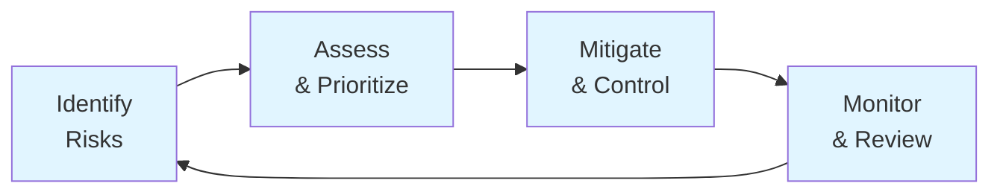

# Risk Register and Management Process

**Project:** GL.iNet Comet GPL Compliance Analysis
**Version:** 1.0
**Last Updated:** 2025-12-12
**Review Frequency:** Quarterly
**Next Review:** 2026-03-15

---

## Risk Management Process

### Purpose

This document defines the risk management process for the GL.iNet Comet GPL Compliance Analysis project, in accordance with ISO 9001:2015 Clause 6.1. It establishes how we identify, assess, mitigate, monitor, and integrate risks into our quality management system and operational workflows.

### Process Overview

### 1. Risk Identification

**When risks are identified:**

- **Proactively:**
  - Project initiation (initial risk assessment)
  - New analysis tasks (via issue templates)
  - Tool or methodology changes
  - External events (legal developments, tool vulnerabilities)

- **Reactively:**
  - Incidents or near-misses
  - Stakeholder concerns
  - Audit findings (when audits implemented)

**Sources of risk information:**
- Project team knowledge and experience
- Historical data from similar projects
- Legal and regulatory monitoring (GPL compliance landscape)
- Technical literature and security advisories
- Stakeholder feedback

**Documentation:**
- New risks added to Active Risks section below
- Risk owner assigned
- Initial assessment performed

### 2. Risk Assessment

**Likelihood Criteria:**

| Level | Definition | Probability |
|-------|-----------|-------------|
| **High** | Expected to occur | >50% chance |
| **Medium** | May occur | 10-50% chance |
| **Low** | Unlikely to occur | <10% chance |

**Impact Criteria:**

| Level | Definition | Consequences |
|-------|-----------|--------------|
| **High** | Severe impact | Project failure, legal liability, major rework |
| **Medium** | Moderate impact | Significant delays, quality issues, reputation damage |
| **Low** | Minor impact | Small delays, easy to correct, limited scope |

**Risk Level Determination:**

## Risk Assessment Matrix

| Likelihood | Impact | Risk Level |
|------------|--------|------------|
| High | High | **Critical** |
| High | Medium | **High** |
| Medium | High | **High** |
| High | Low | **Medium** |
| Medium | Medium | **Medium** |
| Low | High | **Medium** |
| Medium | Low | **Low** |
| Low | Medium | **Low** |
| Low | Low | **Low** |

**Response Priority:**
- **Critical**: Immediate action required, escalate to Project Lead
- **High**: Address within current sprint/planning cycle
- **Medium**: Monitor closely, plan mitigation
- **Low**: Accept or monitor, periodic review

### 3. Risk Treatment (Mitigation)

**Treatment Strategies:**

1. **Avoid:** Eliminate the risk by changing approach
   - Example: Use established tools instead of custom solutions to avoid tool reliability risk

2. **Mitigate:** Reduce likelihood or impact
   - Example: Add regression tests to reduce false positive risk
   - Example: Document methodology rigorously to reduce legal risk

3. **Transfer:** Share risk with external party
   - Example: Use established nix packages instead of manual dependency management

4. **Accept:** Acknowledge risk but take no action (for low-level risks)
   - Example: Accept risk of minor delays from learning new tools

**Mitigation Documentation:**
- Current mitigations listed for each risk in Active Risks section
- Additional actions required specified
- Owner assigned for implementation
- Due dates tracked via GitHub Issues when appropriate

**Integration with Development:**
- High/Critical risks trigger protective measures in code
- Testing strategies address identified technical risks
- Issue templates include risk consideration prompts (future enhancement)

### 4. Risk Monitoring and Control

**Monitoring Frequency:**

| Risk Level | Review Frequency | Trigger Points |
|------------|------------------|----------------|
| Critical | Weekly + ad-hoc | Any risk indicator change |
| High | Monthly + quarterly formal review | Milestone completion, methodology changes |
| Medium | Quarterly review | Standard quarterly review |
| Low | Quarterly review | Standard quarterly review |

**Key Risk Indicators (KRIs):**

- **Legal Risk:** Changes to GPL enforcement landscape, vendor communications
- **Technical Risk:** Test failure rates, bug reports, analysis inconsistencies
- **Operational Risk:** CI/CD success rates, backup status, dependency updates
- **Quality Risk:** Objective performance (see QUALITY-OBJECTIVES.md)

**Monitoring Methods:**
- Automated: CI/CD metrics, test coverage reports, dependency scans
- Manual: Quarterly risk review, issue analysis, stakeholder feedback
- External: GPL compliance news monitoring, tool security advisories

### 5. Integration with Workflows

**Issue Templates:**
- Analysis task template prompts for risk identification
- Bug template includes root cause analysis (addresses risk recurrence)
- Infrastructure template considers tool/dependency risks

**CI/CD Pipeline:**
- Automated tests address technical risks (false positives, regressions)
- Linting/formatting reduces code quality risks
- Coverage thresholds maintain quality baseline

**Code Review:**
- Opus agent reviews significant changes (addresses implementation risks)
- Focus areas aligned with risk register (security, correctness, maintainability)

**Documentation:**
- Source metadata addresses reproducibility risk
- Methodology documentation addresses legal risk
- Test coverage reports address quality risk

### 6. Roles and Responsibilities

**Project Lead:**
- Overall risk management ownership
- Critical/High risk escalation point
- Quarterly risk review facilitation
- Risk register maintenance

**Development Team (Human + AI Agents):**
- Identify risks during work
- Implement mitigations in code/process
- Monitor risk indicators
- Report risk status changes

**AI Agents:**
- Planning Agent: Consider risks during task breakdown
- Development Agent: Implement risk mitigations in code
- Code Reviewer Agent: Identify new risks during review

### 7. Risk Communication

**Internal Communication:**
- Risk register maintained in version control (transparent, auditable)
- High/Critical risks discussed in Management Review (Phase 2)
- Risk updates committed with explanatory commit messages

**External Communication:**
- Methodology documentation addresses stakeholder concerns about legal risk
- Public repository demonstrates transparency (builds trust)
- Analysis results include confidence levels and limitations

### 8. Risk Register Maintenance

**Updates Required When:**
- New risks identified → Add to Active Risks
- Risk status changes (likelihood, impact, mitigations) → Update entry
- Risk resolved/no longer applicable → Move to Closed Risks
- Quarterly review → Update all review dates, reassess all risks
- Significant project changes → Full risk reassessment

**Version Control:**
- All changes to risk register committed to Git
- Change rationale documented in commit messages
- Historical risk data preserved in Git history

---

## Active Risks

### R1: Legal/GPL Compliance Risk
**Category:** Legal
**Likelihood:** Medium
**Impact:** High
**Risk Level:** High

**Description:**
GL.iNet may not have released complete GPL source code for components in the Comet (RM1) firmware, potentially violating GPL licensing obligations.

**Current Mitigations:**
- Black box reverse engineering methodology ensures all findings are independently derived
- Complete traceability system links all findings to automated scripts
- Source metadata documents exact extraction methods
- All analysis scripts are open source and reproducible

**Additional Actions Required:**
- Document methodology in legal-defensible format (covered in Phase 1)
- Consider legal review before public disclosure
- Maintain clear chain of evidence in analysis results

**Owner:** Project Lead
**Review Date:** 2025-03-12

---

### R2: False Positive in Analysis
**Category:** Technical
**Likelihood:** Medium
**Impact:** Medium
**Risk Level:** Medium

**Description:**
Analysis scripts may incorrectly identify proprietary code as GPL-licensed or vice versa, leading to incorrect conclusions.

**Current Mitigations:**
- 619 automated tests with 60%+ coverage requirement enforced by CI
- Code review agent (Opus) performs thorough analysis of significant code changes
- Test-driven development ensures script behavior is verified
- Multiple verification methods (strings, file signatures, etc.)

**Additional Actions Required:**
- Add more integration tests for full analysis pipelines
- Implement peer review for critical findings
- Document confidence levels in findings

**Owner:** Development Team
**Review Date:** 2025-03-12

---

### R3: Dependency Supply Chain Risk
**Category:** Technical
**Likelihood:** Low
**Impact:** Medium
**Risk Level:** Low

**Description:**
Analysis tools (binwalk, strings, etc.) or Python dependencies could have vulnerabilities or unexpected behavior affecting analysis results.

**Current Mitigations:**
- Nix development environment pins all dependencies with cryptographic hashes
- All tools are standard open-source utilities with widespread use
- Reproducible builds via nix flake
- CI runs on trusted GitHub Actions infrastructure

**Additional Actions Required:**
- Document tool versions in results metadata (covered in Phase 3, R9)
- Set up dependency vulnerability scanning
- Periodically verify tool behavior with known test cases

**Owner:** Development Team
**Review Date:** 2025-06-12

---

### R4: Data Loss or Corruption
**Category:** Operational
**Likelihood:** Low
**Impact:** High
**Risk Level:** Medium

**Description:**
Loss of analysis results, scripts, or documentation could require significant rework and delay project completion.

**Current Mitigations:**
- All code and documentation in Git version control
- Repository backed up on GitHub (remote origin)
- Results directory committed to repository
- CI/CD pipeline can regenerate results from scripts

**Additional Actions Required:**
- Implement regular backups of repository
- Document disaster recovery procedures
- Consider additional backup locations

**Owner:** Project Lead
**Review Date:** 2025-06-12

---

### R5: Firmware Download Authenticity
**Category:** Technical
**Likelihood:** Low
**Impact:** High
**Risk Level:** Medium

**Description:**
Downloaded firmware may not be authentic GL.iNet release, leading to analysis of incorrect or tampered files.

**Current Mitigations:**
- Firmware downloaded from official GL.iNet CDN (fw.gl-inet.com)
- Firmware hash/checksum recorded in documentation
- Reproducible download process via scripts

**Additional Actions Required:**
- Verify firmware signature if GL.iNet provides one
- Document chain of custody for firmware files
- Consider checksums in analysis output

**Owner:** Development Team
**Review Date:** 2025-06-12

---

### R6: Insufficient Documentation
**Category:** Quality
**Likelihood:** Medium
**Impact:** Medium
**Risk Level:** Medium

**Description:**
Incomplete or unclear documentation could prevent others from understanding or reproducing analysis, reducing project credibility.

**Current Mitigations:**
- Jinja templates with automatic source citations
- CLAUDE.md documents comprehensive methodology
- All scripts include usage documentation
- Issue templates enforce documentation standards
- Wiki generation from templates

**Additional Actions Required:**
- Complete ISO 9001 documentation (in progress)
- Add more inline comments for complex algorithms
- Create user guide for running analysis

**Owner:** Development Team
**Review Date:** 2025-03-12

---

### R7: Resource/Time Constraints
**Category:** Operational
**Likelihood:** Medium
**Impact:** Low
**Risk Level:** Low

**Description:**
Limited human resources (2-person team) could delay analysis completion or quality improvements.

**Current Mitigations:**
- AI agents handle routine development tasks
- Model-specific agents optimize for cost and capability
- Automated testing reduces manual QA time
- CI/CD automates quality checks
- Efficient workflows documented in CLAUDE.md

**Additional Actions Required:**
- Prioritize critical path items (covered in issue templates)
- Use planning agent for complex work breakdown
- Consider Phase 3 competency management for agent efficiency

**Owner:** Project Lead
**Review Date:** 2025-03-12

---

## Risk Review Process

Risks are reviewed quarterly during Management Review meetings (when implemented in Phase 2, R6).

**Review Checklist:**
- [ ] Review each active risk for status changes
- [ ] Assess effectiveness of mitigations
- [ ] Identify new risks
- [ ] Update likelihood/impact assessments
- [ ] Assign owners and due dates
- [ ] Close resolved risks (moved to Closed Risks section)

## Closed Risks

*(No closed risks yet)*

---

## Risk Escalation Criteria

**Immediate Escalation Required:**
- Any risk becomes Critical (High likelihood + High impact)
- Legal risk becomes actionable (e.g., cease & desist letter)
- Data loss occurs
- Security breach of repository or systems

**Escalation Contact:** Project Lead

---

*This risk register is a living document and should be updated as risks evolve.*
