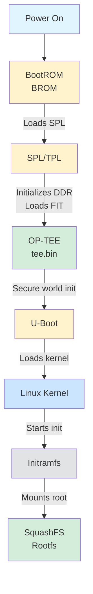

# Rockchip RV1126 Boot Chain

[← Analysis Reports](../analysis/SUMMARY.md)

---

Standard boot chain for Rockchip RV1126 SoC devices.

## Boot Sequence

## Components

| Stage | Component | Purpose |
|-------|-----------|---------|
| 1 | BootROM | Fixed in silicon, initializes clocks and loads SPL |
| 2 | SPL/TPL | DDR initialization, loads main bootloader |
| 3 | OP-TEE | Trusted Execution Environment for secure operations |
| 4 | U-Boot | Full bootloader, loads and verifies kernel |
| 5 | Kernel | Linux kernel with device tree |
| 6 | Initramfs | Early userspace, mounts root filesystem |
| 7 | Rootfs | Main filesystem (SquashFS for embedded devices) |

## References

- [Rockchip Wiki - Boot Flow](https://opensource.rock-chips.com/wiki_Boot_option)
- [U-Boot FIT Image Documentation](https://u-boot.readthedocs.io/en/latest/usage/fit/index.html)
