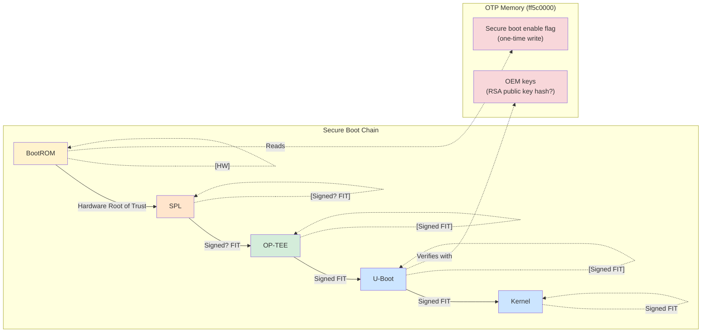

# Rockchip RV1126 Secure Boot Architecture

[← Analysis Reports](../analysis/SUMMARY.md)

---

Reference documentation for Rockchip secure boot implementation.

## Security Architecture

## Key Components

| Component | Role in Secure Boot |
|-----------|---------------------|
| BootROM | Fixed in silicon, root of trust |
| OTP Memory | Stores secure boot flag and key hashes |
| OP-TEE | Manages secure boot flags via trusted services |
| U-Boot | Verifies FIT image signatures if enabled |
| FIT Images | Can contain RSA2048+SHA256 signatures |

## Verification Requirements

To verify secure boot status on a device:

| Test | How to Verify |
|------|---------------|
| OTP secure boot flag | Read OTP via UART/OP-TEE or attempt unsigned boot |
| Signature enforcement | Attempt to boot modified FIT image |
| Key validity | Check if signature verification passes |

## Implications

### If OTP secure boot flag is NOT set:
- FIT signatures present but NOT verified
- Custom firmware can boot
- This is common for consumer devices

### If OTP secure boot flag IS set:
- U-Boot verifies FIT signatures before loading
- Only firmware signed with matching key will boot
- Maskrom mode may still allow low-level flashing

## References

- [Rockchip Security Guide](https://opensource.rock-chips.com/wiki_Security)
- [U-Boot FIT Signature Documentation](https://u-boot.readthedocs.io/en/latest/usage/fit/signature.html)
